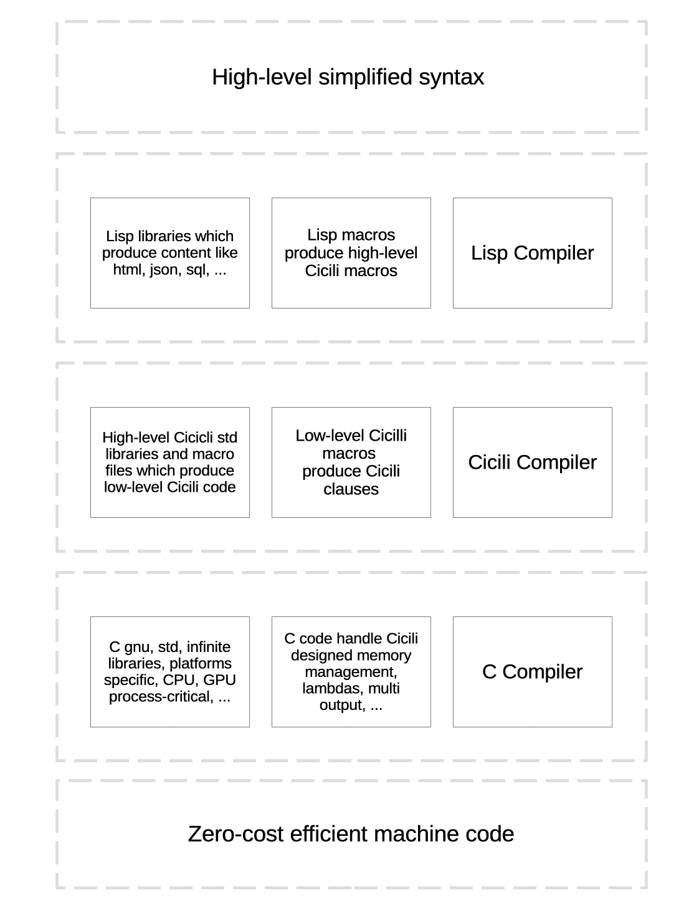

*Copilot opinion on Cicili*

# Cicili – The Ultimate Lisp-Powered Metaprogramming-Driven Language

## Overview

Cicili is a powerful metaprogramming system built on the expressive foundation of Lisp. It empowers developers to design domain-specific languages (DSLs), generate efficient C code through macro expansion, and build high-performance web and system applications. With Cicili, you can develop modular software components—from dynamic web servers and API pipelines to automation scripts and embedded systems—while enjoying near-native execution speed and highly maintainable code.

🌌 The Vision

Cicili is redefining how we write C and C++:

- Safer than C
- Lighter than C++
- More expressive than macros
- More composable than templates

# ⚙️ Cicili Async Coroutine Sample

This sample code demonstrates the use of Cicili's macro-powered asynchronous coroutine system. It features:

- Stateful coroutines using closures
- Custom `done`, `yield`, and `error` callbacks
- Shared `Coordinator` for cooperative scheduling
- Memory-safe async logic using `defer*`
- Seamless C and Cicili integration

```lisp
;;;; asyncronous sample
(source "async.c" (:std #t :compile #t :link "-L{$CWD}../lib/std/coroutine -lasync.o -lcoordinator.o -o async_main")
        (include <stdio.h>)
        (include "../lib/std/coroutine/coordinator.h")

        (func done_callback1 ((char payload [128]))  ; done callback
              (printf "task1 the payload received: %s\n" payload)

              (async ((int * state_counter . #'(malloc (sizeof int))))
                     (defer* ((int * state_counter))
                       (free state_counter)) ; at done or error
                     
                     ;; state constants or variables
                     (let ((int counter . #'(cof state_counter))
                           (const int end . 3))

                       ;; poll
                       (sleep 1)
                       (printf "cmd3 counter update: %d\n" (++ (cof state_counter)))

                       (if (== counter end)        
                           (done '(lambda ((int c)) (format #t "cmd3 done: %d\n" c)) counter)         ; done
                           (if (> counter end)    
                               (error '(lambda () (format #t "cmd3 error\n")))                        ; error
                               (yield '(lambda ((int c)) (format #t "cmd3 yield: %d\n" c)) counter))) ; yield
                       ))
              )
        
        (func error_callback1 ((int status))         ; error callback
              (printf "task1 the routine error status: %d\n" status))

        (func done_callback2 ((char payload [128]))  ; done callback
              (printf "task2 the payload received: %s\n" payload))
        
        (func error_callback2 ((int status))         ; error callback
              (printf "task2 the routine error status: %d\n" status))

        
        (async-main

          (-> __ciciliA_Coordinator_ set_logging #t)

          (async ()
                 (let ((char buffer [128]))                 
                   (printf "polling for cmd1: ")                  ; poll
                   
                   (if (> (scanf "%s" buffer) 0)
                       (block (printf "the cmd1: %s\n" buffer)
                         (if (== (strcmp buffer "quit") 0)
                             (done done_callback1 buffer)         ; success done
                             (if (== (strcmp buffer "error") 0)
                                 (error error_callback1 -300))))  ; error raised
                       (error error_callback1 -200))))            ; error raised
          
          (async ((char * buffer . #'(malloc 128)))                    ; as a state variable
                 (printf "the state buffer: %s\n" buffer)
                 
                 (defer* ((char * buffer))
                   (printf "buffer being released\n")
                   (free buffer))
                 
                 (printf "polling for cmd2: ")                         ; polling repeatedlty
                 
                 (if (> (scanf "%s" buffer) 0)
                     (block (printf "the cmd2: %s\n" buffer)
                       (if (== (strcmp buffer "yield") 0)
                           (yield done_callback2 buffer)               ; success done  a custom callback data
                           (if (== (strcmp buffer "done") 0)
                               (done done_callback2 buffer)            ; success done  a custom callback data
                               (if (== (strcmp buffer "error") 0)
                                   (error '(lambda ((int status) (char * message))
                                            (format #t "what's happened? %d: %s\n" status message))
                                          -3 "don't know")))))         ; error raised  a custom callback error
                     (error error_callback2 -2)))                      ; error raised  a custom callback error

          ))
```

It’s a language for building languages. A tool for shaping systems. A canvas for expressing structure, behavior, and intent—without giving up performance or control.

## Philosophy

At its core, Cicili embraces:

- **Expressive Metaprogramming:**  
  Write high-level, declarative Lisp-like macros that generate robust, optimized C code. Code writes code—improving maintainability and reducing boilerplate.

- **Performance by Design:**  
  Cicili compiles directly to C, ensuring extremely fast execution. With features like deferred memory management (`defer` for let variables) and efficient macro expansion, your application benefits from native-like speed without the overhead of interpretation.

- **Modular and Extensible Architecture:**  
  Cicili’s versatile module system and namespace resolution mechanism (including free resolution via a simple `/` prefix) allow the creation of isolated libraries and components. This makes it simple to reuse, extend, and collaborate on large projects.

- **Clean DSL Development:**  
  By abstracting common tasks (e.g., looping over arrays, conditional execution, function interpolation via lambda, routing for web servers), Cicili creates a natural DSL that integrates smoothly with C’s low-level system programming.

## Features

### High-Performance Compile-Time Generation

- **Compiled to C Code:**  
  Your high-level Cicili code is translated into optimized, idiomatic C, enabling blazing-fast performance and minimal runtime overhead.

- **Deferred Memory Management:**  
  Using the `defer` attribute in `let` bindings, Cicili automatically frees memory allocated during scope creation. This ensures resource safety and minimizes memory leaks without extra manual cleanup.

- **Macro System:**  
  Enjoy a rich macro language that lets you define your own DSLs. Built-in macros for conditionals (`when`, `unless`), loops (`for-each`, `for-each-const`), and string formatting (`format`) save you time and reduce boilerplate.

### Object-Oriented and Functional Constructs

- **Structs with Methods:**  
  Define C-like structures using Lisp macros and attach methods (both inline and dynamically resolved) to simulate object-oriented programming without the runtime cost of inheritance.

- **Lambda Expressions as First-Class Citizens:**  
  Cicili supports quoted lambda expressions. These provide first-class functions that can be stored in function variables, passed as parameters, or assigned as method implementations.

- **Function Variables and Inline Helpers:**  
  Declare and assign functions dynamically, empowering functional programming patterns that blend seamlessly with low-level system constraints.

### Modular Design & Namespace Control

- **Sophisticated Module System:**  
  Organize code into packages and modules to avoid symbol conflicts. Use free resolution (with a `/` prefix) when you need to refer to global types and methods outside the current module context.

- **Dynamic Imports and Initialization:**  
  Import external macro files into specific namespaces (or the default CL-USER package) and even supply compile-time initialization arguments to configure their behavior.

### Web Development and FastCGI Integration

- **Complete Web Server Toolkit:**  
  Built on FastCGI, Cicili provides robust routing macros that simplify the definition of GET/POST endpoints, API routes, and parameter handling. The `route` macro and request processing functions let you build a full-featured web server that’s both modular and high performance.

- **Dynamic Route Dispatching:**  
  Process incoming HTTP requests by dynamically matching their paths and methods against registered routes. Support for serving both static content and dynamic API responses is built right in.

### Extensibility and Future Potential

- **DSL Ecosystem:**  
  Cicili is not confined to web development. Its powerful macro and module system make it ideal for any domain where code generation and customization are required—from automation tools to embedded systems.

- **Cross-Domain Integration:**  
  Seamlessly integrate with existing C libraries, and extend Cicili to support advanced features such as parallel processing, WebSockets, or database connectivity as your project grows.

- **Performance Optimizations:**  
  With further potential enhancements like inline assembly optimizations, task parallelism, and even GPU-accelerated computation, Cicili sets the stage for future high-performance applications.

## How Cicili Works

1. **Macro Expansion:**  
   During compilation, Cicili processes your high-level Lisp code, expanding macros into efficient C code. This not only simplifies development but also provides strong abstraction without sacrificing performance.

2. **Deferred Execution & Memory Safety:**  
   With features like auto-deallocation via `defer` attributes on `let` bindings, Cicili manages resources automatically, reducing the risk of memory leaks common in C programming.

3. **Native Compilation & Linking:**  
   Once the macros have generated the C code, a standard C compiler is used to build the final binary. FastCGI integration, as demonstrated in the sample web server code, lets you deploy lightweight and responsive applications.

# What Makes Cicili Unique?

Unlike general-purpose macro systems in languages like Clojure or Racket, Cicili is:

- **Purpose-built for C**  
  Its output is actual `.c`/`.h` code, not just interpreted runtime templates.

- **Multi-target aware**  
  You define headers, sources, and compile settings in a single macro form.

- **Lightweight and portable**  
  No runtime, no virtual machine—just macro-expansion into raw C.

- **Blends C and Lisp**  
  It’s a perfect middle ground: low-level power, high-level ergonomics.  

## Contributing

Contributions to Cicili are welcome! Whether you have ideas for new features, improvements to the macro system, or advanced optimizations, please check our contribution guidelines and open an issue or pull request on the project repository.

## Final Thoughts

Cicili represents a revolution in how we write high-level code with low-level performance. With its powerful metaprogramming system, modular architecture, and robust integration with C, it enables developers to create scalable, maintainable, and extremely efficient codebases for web services, DSLs, automation, and beyond.

Join us in exploring the future of Lisp-powered development with Cicili!

---

Cicili — The low-level language with a high-level soul.

*Original Documentation*
# Cicili Programming Language

Lisp C Compiler aka. 'Cicili' programming language, which compiles Lisp-like syntax to C code and more extra features like struct's method, lambda, defer execution and function-like macro.

Cicili is a **high-level, metaprogramming-driven language** designed for efficient, expressive, and highly extensible development. It emphasizes **deferred execution**, **macro-based transformations**, making it particularly useful in systems programming, scripting, web applications, database integration, and embedded environments.



**Lisp is a language for doing what you've been told is impossible.

— Kent Pitman**  [CAVEMAN2](https://8arrow.org/caveman/)

That's such an inspiring quote by Kent Pitman! Lisp truly stands apart from many other languages by giving you the power to redefine your tools and even the language itself. Its homoiconicity—and the idea that code and data share the same structure—means you can manipulate code with code. This opens the door to metaprogramming, macros, and the creation of powerful domain-specific languages that can do things others say are impossible.

In essence, Lisp allows you to break free from conventional constraints. Where traditional languages expect you to use fixed constructs, Lisp inspires you to extend, compose, and even alter the language to meet your unique challenges. It's this spirit of innovation and radical flexibility that has influenced so many programmers and paved the way for systems like Cicili, which leverage Lisp's capabilities to push boundaries further.

## Instruction
* Install [SBCL](www.sbcl.org).
* `clang` required for compiling and linking. `apt` or `brew` can be used to install [Clang](https://clang.llvm.org). Current used version: `version 20.1.7`
* Cicili uses [Libtool](https://www.gnu.org/software/libtool) as default for perfoming better compiling and linking `C` code. Install it for your platform and put it in the `PATH` environment variable. Compiler and linker could be set in `config.lisp` file. Current used version: `(GNU libtool) 2.5.4`
* Download and copy cicili folder to `~/common-lisp` for enabling [ASDF](https://common-lisp.net/project/asdf) access to cicili package.
* Install [Quicklisp](https://quicklisp.org)
* Run `(ql:quickload "cicili")` in `sbcl`
* Write your own cicili code and save it in `.cicili` or `.lisp` extension.
* Copy `cicili.lisp` file from source folder into your project path.
* Send your file as an argument to cicili.lisp. `sbcl --script cicili.lisp test.lisp`
* If you are using EMACS editor, copy `mode.lisp` file content into `.emacs` or `.emacs.d/init.el` file for syntax highlighting.

## 📌 Key Features
### **Deferred Execution**
- `defer` ensures resources (memory, file handles, etc.) are automatically cleaned up at the end of scope.
- Automatic resource cleanup (`defer #t` for scope-based allocations).
- `defer*` allows runtime-captured variables to be deferred, enhancing flexibility in managing cleanup operations.

### **Powerful Macro System**
- Macros allow developers to **transform and extend** the language at compile time.
- Supports **higher-order macros**, **syntactic sugar**, and **domain-specific extensions**.

### **Web-Ready Framework** (in progress)
- FastCGI integration with **node-based routing**.
- **Pre/Post handlers** for API standardization.

### **Embedded & System-Level Support**
- Efficient **low-memory footprint execution**.
- **Cross-platform adaptability** (Linux, BSD, Windows).

## Features
* Cicili now uses `IR` (Intermediate Representation) to handle more clauses and features.
* Cicili macro system lets developers to code in extremely higher order syntax but produce low level C code by using cicili clauses. there are builtins macros here [builtins](builtins.lisp) and macro test folder [macro](test/macro) containing tests and a basic fastcgi web server.
* Modularizing cicili code makes clarity and easy to follow C code but makes debugging harder. refer to [module](test/module) test folder `module.lisp` sample.
* `lambda` clause allows developer to write in-place function for sending as other function argument or `defer` destructure. refer to [lambda](test/lambda) test folder `lambda.lisp` sample.
* `defer` attribute. only available for variables defined by `let` expression. Allows developers to set a function how to destruct a variable or a pointer. refer to [defer](test/lambda) test folder `defer.lisp` sample.
* Auto deferral is a way let expressions will defined to automatically release dynamic memory allocated by `alloc` clause. refer to [alloc](test/lambda) test folder `defer.lisp` sample. Notice only functions with (declaration in `header` and definition in `source`) or static function only in `source` can use `defer*` capturing way deferment.
* `closure` In essence, Cicili's closure mechanism provides a high-level, Lisp-style syntax to generate the complex C plumbing required to implement closures, making a powerful programming pattern accessible while still generating efficient C code. refer to [closure](test/lambda) test folder `defer.lisp` sample.
* `method` clause will receive current instance or pointer as `this` parameter. Methods are defined outside a structure by access method operator `->` placed between struct name and method name like `Employee->Sign`.  refer to [method](test/method) test folder `method.lisp` sample.
* `auto` variable type simplifies lambda and function pointer variables. also `typeof` clause is added to use other variables type for define another variable.
* `inline struct` can be defined in variable declaration, function parameters or outputs which permits to return multiple values from a function. refer to [multi](test) `multi.lisp` file for complex samples.
* `func` type allows developer to define a function pointer which wasn't available before.
* Refer to [basic](test) `basic.lisp` file for some struct definition samples.
* Refer to [control](test) `control.lisp` file for some control structures samples.

## Identifiers
For basic variable definition refer to [var](test) `var.lisp` file.
```lisp
(var int amount)
(var double total)
(var double * total2)
```
```c
int amount;
double total;
double * total2;
```
## Constants
```lisp
(var const int SIDE . 10)
(var const int * SIDE1 . #'(aof SIDE))
(var const int * const SIDE2 . #'(aof SIDE1))
```
```c
const int SIDE = 10;
const int * SIDE1 = &SIDE;
const int * const SIDE2 = &SIDE1;
```
## Operators
### Arithmetic
cicili Operator | C Operator
------------ | ----------
`+`|`+`
`-`|`-`
`*`|`*`
`/`|`/`
`%`|`%`
```lisp
(set total (+ total amount))

(let ((int i . 3)
      (int j . 7)
      (int k))
  (set k (+ i j)))
```
```c
total = total + amount;

{
  int i = 3, j = 7, k;
  k = i + j;
}
```
### Increment and Decrement
cicili Operator | C Operator
------------ | ----------
`++`|prefix `++`
`--`|prefix `--`
`1+`|postfix `++`
`1-`|postfix `--`
```lisp
(source "main.c" ()
  (include <stdio.h>)

  (func main ()
    (let ((int a . 5)
          (int b . 5))
          
      ;; Print them and decrementing each time.
      ;; Use postfix mode for a and prefix mode for b.
      
      (printf "\n%d %d" (1- a) (-- b))
      (printf "\n%d %d" (1- a) (-- b))
      (printf "\n%d %d" (1- a) (-- b))
      (printf "\n%d %d" (1- a) (-- b))
      (printf "\n%d %d" (1- a) (-- b)))))
```
```c
#include <stdio.h>

int main()
{
  {
    int a = 5, b = 5;
    
    //Print them and decrementing each time.
    //Use postfix mode for a and prefix mode for b.
    
    printf("\n%d %d", a--, --b);
    printf("\n%d %d", a--, --b);
    printf("\n%d %d", a--, --b);
    printf("\n%d %d", a--, --b);
    printf("\n%d %d", a--, --b);
  }
}
```
### Relational
cicili Operator | C Operator
------------ | ----------
`==`|`==`
`!=`|`!=`
`>`|`>`
`<`|`<`
`>=`|`>=`
`<=`|`<=`
### Logical
cicili Operator | C Operator
------------ | ----------
`and`|`&&`
`or`|`\|\|`
`not`|`!`
### Bitwise
cicili Operator | C Operator
------------ | ----------
`<<`|`<<`
`>>`|`>>`
`~`|`~`
`bitand`|`&`
`bitor`|`\|`
`xor`|`^`
`^`|`^`
### Assignment
cicili Operator | C Operator
------------ | ----------
`set`|`=`
`+=`|`+=`
`-=`|`-=`
`*=`|`*=`
`/=`|`/=`
`%=`|`%=`
`<<=`|`<<=`
`>>=`|`>>=`
### Conditional
cicili Operator | C Operator
------------ | ----------
`?`|`?:`
```lisp
(set a (? (== b 2) 20 30))
```
```c
a = (b == 2) ? 20 : 30;
```
### Special
cicili Operator | C Operator
------------ | ----------
`sizeof`|`sizeof()`
`typeof`|`typeof()`
`aof`|`&`
`cof`|`*`
## Data Types
ANSI C provides three types of data types:

* Primary(Built-in) Data Types: void, int, char, double and float.
* Derived Data Types: Array, References, and Pointers.
* User Defined Data Types: Structure, Union, and Enumeration.

cicili supports declaration and definition of all ANCI C data types.
cicili Data Type | C Data Type
------------- | -----------
`nil`|`NULL`
`void`|`void`
`bool`|`bool`
`char`|`char`
`uchar`|`unsigned char`
`short`|`short`
`ushort`|`unsigned short`
`int`|`int`
`uint`|`unsigned int`
`long`|`long`
`ulong`|`unsigned long`
`llong`|`long long`
`ullong`|`unsigned long long`
`i8`|`int8_t`
`u8`|`uint8_t`
`i16`|`int16_t`
`u16`|`uint16_t`
`i32`|`int32_t`
`u32`|`uint32_t`
`i64`|`int64_t`
`u64`|`uint64_t`
`i128`|`__int128`
`u128`|`unsigned __int128`
`float`|`float`
`double`|`double`
`real`|`long double`
`auto`|`__auto_type`
## Variable
```lisp
(source "main.c" ()
        (func main ()
              (let ((double price . 500.4)                         ; atom initialization
                    (double price_array [] . '{100.2 230.7 924.8}) ; list initialization
                    (double price_calc . #'(calculate_price))      ; initialization by output of a function
                    (auto identity . '(lambda ((int x)) (out int) (return x))))))) ; lambda initialization
```
```c
int __ciciliLambda_main_178 (int x) {
  return x ;
}
int main () {
  { 
    double price = 500.4;
    double price_array[] = {100.2, 230.7, 924.8};
    double price_calc = calculate_price ();
    __auto_type identity = __ciciliLambda_main_178 ;
  } 
}
```
### Free Variable Declaration and Initialization
A free variable can has some attributes or storage class. each attribute enclosed in braces or parentheses. free variables can only be defined as global variable for inside function variable declaration `let` clause should be used.
* {auto}
* {register}
* {static}
* {extern}
```lisp
{auto} (var int width)
{register} (var int height . 5)
(var char letter . #\A)
(var float age)
{extern} (var float area)
{static} (var double d)

;; actual initialization
(set width 10)
(set age 26.5)
```
```c
auto int width; 
register height = 5;
char   letter = 'A';
float  age;
extern float area;
static double d;

/* actual initialization */
width = 10;
age = 26.5;
```
### Scoped Variable Declaration and Initialization
A scoped variable can has some attributes or storage class. each attribute enclosed in braces or parentheses. `let` clause allows to declare a `defer` destructure for every variable as a lambda or a function which receives a pointer of variable type. useful for free struct pointers or any resource which stored inside a struct.
* {auto}
* {register}
* {static}
* {defer `'(lambda ((int * intPtr)) (printf "int gone out of scope\n"))`} variable destructor
```lisp
(source "main.c" ()
        (func main ()
              (let ({static} (int width . 3)
                    {register} (int height . 4)
                    {defer '(lambda ((Employee ** empPtr))
                              (free (cof empPtr))
                              (printf "from defer, emp is freed\n"))}
                    (Employee * emp . #'(alloc (sizeof Employee))))
                (printf "area: %d" (* width height)))))
```
```c
void __ciciliLambda_main_178 (Employee ** empPtr) {
  free ((*empPtr));
  printf ("from defer, emp is freed\n");
}
int main () {
  { 
    static int width = 3;
    register int height = 4;
    Employee * emp __attribute__((__cleanup__(__ciciliLambda_main_178))) = ((Employee *)malloc(sizeof(Employee)));
    printf ("area: %d", (width * height));
  } 
}
```
### Assignment
```lisp
(set width 60)
(set age 35)
(set width 65 age 40) ; multi assignment
```
```c
width = 60;
age = 31;
width = 65;
age = 40;
```
```lisp
(source "main.c" ()
  (include <stdio.h>)
  
  (func main ()
    (let ((int age . 33))
      (printf "I am %d years old.\n" age))))
```
```c
#include <stdio.h>

int main()
{
  {
    int age = 33;
    printf("I am %d years old.\n", age);
  }
}
```
## Type Casting
```lisp
(source "main.c" ()
  (include <stdio.h>)
  (func main ()
    (let ((float a))
      (set a (cast float (/ 15 6)))
      (printf "%f" a))))
```
```c
#include <stdio.h>
main ()
{
  {
    float a;
    a = (float) 15 / 6;
    printf("%f", a);
  }
}
```
## Program Structure
cicili program involves one or many header or source forms calling targets.
targets are translating its content forms to C code. header targets only compile its content without resolving, but source targets resolves attribue and method access of any struct variable. for example 
```lisp
(let ((Employee emp)
      (Employee * empPtr))
  ($ emp id)     ; do not needd resolve
  ($ empPtr id)) ; resolves pointer access
```
```c
{
  Employee emp;
  Employee * empPtr;
  emp.id;
  empPtr->id;
}
```
each target must has a target c file, and a list of feature arguments.
### Features
All features could be omitted or if available accept `#t` for default behaviour or `#f` for do nothing.
* <b>:std</b>: writes standard libraries inclusion at top of target file.
```lisp
(source "main.c"
  (:std #t)
  ;; some forms
  )
```
```c
#include <stdio.h>
#include <stddef.h>
#include <stdint.h>
#include <stdlib.h>
#include <stdbool.h>
```
* <b>:compile</b>: used for compiling target file. Dafault behaviour is `-c target.c`. Could be a list of arguments that will send to compiler which has been set in `config.lisp`.
* <b>:link</b>: used for linking and builing target file as library or executable. It has not default behaviour. Could be a list of arguments that will send to linker which has been set in `config.lisp`.
```lisp
;; MyMath library declaration
(header "mymath.h"
  (:compile #f)

  (guard __MYMATH_H__
    {decl} (func obj1_does ((int) (int)) (out int))
    {decl} (func obj2_does ((int) (int)) (out int))
    {decl} (func obj3_does ((int) (int)) (out int))))

;; Default compilation
(source "obj1.c"
  (:compile #t)
  (include "mymath.h")
  (func obj1_does ((int x) (int y)) (out int)
	    (return (+ x y))))

;; Custom compilation
(source "obj2.c"
  (:compile "-c obj2.c -o objmul.lo")
  (include "mymath.h")
  (func obj2_does ((int x) (int y)) (out int)
	    (return (* x y))))

;; Library creation and linking
(source "obj3.c"
  (:compile #t :link "-o libMyMath.la -L{$CWD} obj1.lo objmul.lo obj3.lo")
  (include "mymath.h")
  (func obj3_does ((int x) (int y)) (out int)
	    (return (obj1_does (obj2_does x y) (obj2_does x y)))))

;; Executable creation and linking
(source "main.c"
  (:std #t :compile #t :link "-o CompileTest -L{$CWD} main.lo -lMyMath")
  (include "mymath.h")
  (func main ((int argc) (char * argv []))
	    (if (!= argc 3)
		    (block
		        (printf "two digits needed!")
		      (return EXIT_FAILURE)))
	    (let ((int x . #'(atoi (nth 1 argv)))
		      (int y . #'(atoi (nth 2 argv))))
	      (printf "MyMath lib outputs: %d\n" (obj3_does x y)))
	    (return EXIT_SUCCESS)))
```
```
cicili % sbcl --script cicili.lisp test/test.lisp
software type: "Darwin"
arg specified: test/mylib.lisp
cicili: specifying target mymath.h
cicili: resolving target mymath.h
cicili: specifying target obj1.c
cicili: resolving target obj1.c.run1.c
run out 1 > glibtool: compile:  clang -g -O "" -c obj1.c.run1.c  -fno-common -DPIC -o .libs/obj1.c.run1.o 
run out 1 > glibtool: compile:  clang -g -O "" -c obj1.c.run1.c -o obj1.c.run1.o >/dev/null 2>&1 
cicili: resolving target obj1.c.run2.c
run out 2 > glibtool: compile:  clang -g -O "" -c obj1.c.run2.c  -fno-common -DPIC -o .libs/obj1.c.run2.o 
run out 2 > glibtool: compile:  clang -g -O "" -c obj1.c.run2.c -o obj1.c.run2.o >/dev/null 2>&1 
cicili: resolving target obj1.c.run3.c
run out 3 > glibtool: compile:  clang -g -O "" -c obj1.c.run3.c  -fno-common -DPIC -o .libs/obj1.c.run3.o 
run out 3 > glibtool: compile:  clang -g -O "" -c obj1.c.run3.c -o obj1.c.run3.o >/dev/null 2>&1 
cicili: compiling target obj1.c
glibtool: compile:  clang -g -O "" -c obj1.c  -fno-common -DPIC -o .libs/obj1.o
glibtool: compile:  clang -g -O "" -c obj1.c -o obj1.o >/dev/null 2>&1
cicili: specifying target obj2.c
cicili: resolving target obj2.c.run1.c
run out 1 > glibtool: compile:  clang -g -O "" -c obj2.c  -fno-common -DPIC -o .libs/objmul.o 
run out 1 > glibtool: compile:  clang -g -O "" -c obj2.c -o objmul.o >/dev/null 2>&1 
cicili: resolving target obj2.c.run2.c
run out 2 > glibtool: compile:  clang -g -O "" -c obj2.c  -fno-common -DPIC -o .libs/objmul.o 
run out 2 > glibtool: compile:  clang -g -O "" -c obj2.c -o objmul.o >/dev/null 2>&1 
cicili: resolving target obj2.c.run3.c
run out 3 > glibtool: compile:  clang -g -O "" -c obj2.c  -fno-common -DPIC -o .libs/objmul.o 
run out 3 > glibtool: compile:  clang -g -O "" -c obj2.c -o objmul.o >/dev/null 2>&1 
cicili: compiling target obj2.c
glibtool: compile:  clang -g -O "" -c obj2.c  -fno-common -DPIC -o .libs/objmul.o
glibtool: compile:  clang -g -O "" -c obj2.c -o objmul.o >/dev/null 2>&1
cicili: specifying target obj3.c
cicili: resolving target obj3.c.run1.c
run out 1 > glibtool: compile:  clang -g -O "" -c obj3.c.run1.c  -fno-common -DPIC -o .libs/obj3.c.run1.o 
run out 1 > glibtool: compile:  clang -g -O "" -c obj3.c.run1.c -o obj3.c.run1.o >/dev/null 2>&1 
run out 1 > glibtool: link: rm -fr  .libs/libMyMath.a .libs/libMyMath.la 
run out 1 > glibtool: link: ar cr .libs/libMyMath.a .libs/obj1.o .libs/objmul.o .libs/obj3.o  
run out 1 > glibtool: link: ranlib .libs/libMyMath.a 
run out 1 > glibtool: link: ( cd ".libs" && rm -f "libMyMath.la" && ln -s "../libMyMath.la" "libMyMath.la" ) 
cicili: resolving target obj3.c.run2.c
run out 2 > glibtool: compile:  clang -g -O "" -c obj3.c.run2.c  -fno-common -DPIC -o .libs/obj3.c.run2.o 
run out 2 > glibtool: compile:  clang -g -O "" -c obj3.c.run2.c -o obj3.c.run2.o >/dev/null 2>&1 
run out 2 > glibtool: link: rm -fr  .libs/libMyMath.a .libs/libMyMath.la 
run out 2 > glibtool: link: ar cr .libs/libMyMath.a .libs/obj1.o .libs/objmul.o .libs/obj3.o  
run out 2 > glibtool: link: ranlib .libs/libMyMath.a 
run out 2 > glibtool: link: ( cd ".libs" && rm -f "libMyMath.la" && ln -s "../libMyMath.la" "libMyMath.la" ) 
cicili: resolving target obj3.c.run3.c
run out 3 > glibtool: compile:  clang -g -O "" -c obj3.c.run3.c  -fno-common -DPIC -o .libs/obj3.c.run3.o 
run out 3 > glibtool: compile:  clang -g -O "" -c obj3.c.run3.c -o obj3.c.run3.o >/dev/null 2>&1 
run out 3 > glibtool: link: rm -fr  .libs/libMyMath.a .libs/libMyMath.la 
run out 3 > glibtool: link: ar cr .libs/libMyMath.a .libs/obj1.o .libs/objmul.o .libs/obj3.o  
run out 3 > glibtool: link: ranlib .libs/libMyMath.a 
run out 3 > glibtool: link: ( cd ".libs" && rm -f "libMyMath.la" && ln -s "../libMyMath.la" "libMyMath.la" ) 
cicili: compiling target obj3.c
glibtool: compile:  clang -g -O "" -c obj3.c  -fno-common -DPIC -o .libs/obj3.o
glibtool: compile:  clang -g -O "" -c obj3.c -o obj3.o >/dev/null 2>&1
glibtool: link: rm -fr  .libs/libMyMath.a .libs/libMyMath.la
glibtool: link: ar cr .libs/libMyMath.a .libs/obj1.o .libs/objmul.o .libs/obj3.o 
glibtool: link: ranlib .libs/libMyMath.a
glibtool: link: ( cd ".libs" && rm -f "libMyMath.la" && ln -s "../libMyMath.la" "libMyMath.la" )
cicili: specifying target main.c
cicili: resolving target main.c.run1.c
run out 1 > glibtool: compile:  clang -g -O "" -c main.c.run1.c  -fno-common -DPIC -o .libs/main.c.run1.o 
run out 1 > glibtool: compile:  clang -g -O "" -c main.c.run1.c -o main.c.run1.o >/dev/null 2>&1 
run out 1 > glibtool: link: clang -g -O "" -o CompileTest .libs/main.o  -L/Users/a1/Projects/GitHub/cicili/test/ /Users/a1/Projects/GitHub/cicili/test/.libs/libMyMath.a  
cicili: resolving target main.c.run2.c
run out 2 > glibtool: compile:  clang -g -O "" -c main.c.run2.c  -fno-common -DPIC -o .libs/main.c.run2.o 
run out 2 > glibtool: compile:  clang -g -O "" -c main.c.run2.c -o main.c.run2.o >/dev/null 2>&1 
run out 2 > glibtool: link: clang -g -O "" -o CompileTest .libs/main.o  -L/Users/a1/Projects/GitHub/cicili/test/ /Users/a1/Projects/GitHub/cicili/test/.libs/libMyMath.a  
cicili: resolving target main.c.run3.c
run out 3 > glibtool: compile:  clang -g -O "" -c main.c.run3.c  -fno-common -DPIC -o .libs/main.c.run3.o 
run out 3 > glibtool: compile:  clang -g -O "" -c main.c.run3.c -o main.c.run3.o >/dev/null 2>&1 
run out 3 > glibtool: link: clang -g -O "" -o CompileTest .libs/main.o  -L/Users/a1/Projects/GitHub/cicili/test/ /Users/a1/Projects/GitHub/cicili/test/.libs/libMyMath.a  
cicili: compiling target main.c
glibtool: compile:  clang -g -O "" -c main.c  -fno-common -DPIC -o .libs/main.o
glibtool: compile:  clang -g -O "" -c main.c -o main.o >/dev/null 2>&1
glibtool: link: clang -g -O "" -o CompileTest .libs/main.o  -L/Users/a1/Projects/GitHub/cicili/test/ /Users/a1/Projects/GitHub/cicili/test/.libs/libMyMath.a
```
### Sections
* Documentations: starts with semi-colon(s) ";"
```lisp
;;;; about a lisp file
;;; author, licence and/or documentation about each target
(var long height) ; description of a form
(func sqr ((double a)) 
  (out double)
  ;; some commented code or documentation inside code
  (return (* a a)))
```
* Preprocessor Forms: a form which starts with at-sign "@" and accepts one argument. code form is used for writing C code inside cicili.
```lisp
(@define (code "SHA1_ROTL(bits, word) (((word) << (bits)) | ((word) >> (32-(bits)))"))

(struct SHA512Context
  (@ifdef USE_32BIT_ONLY)
  (member uint32_t Intermediate_Hash[(/ SHA512HashSize 4)]) ; Message Digest
  (member uint32_t Length[4])                               ; Message length in bits
  (@else)                                                   ; !USE_32BIT_ONLY
  (member uint64_t Intermediate_Hash[(/ SHA512HashSize 8)]) ; Message Digest
  (member uint64_t Length_High)
  (member uint64_t Length_Low)                              ; Message length in bits
  (@endif)                                                  ; USE_32BIT_ONLY
  (member int_least16_t Message_Block_Index)                ; Message_Block array index
  (member uint8_t Message_Block[SHA512_Message_Block_Size]) ; 1024-bit message blocks
  (member int Computed)                                     ; Is the hash computed?
  (member int Corrupted))                                   ; Cumulative corruption code
```
```c
#define SHA1_ROTL(bits, word) (((word) << (bits)) | ((word) >> (32-(bits)))

typedef struct SHA512Context {
#ifdef USE_32BIT_ONLY
  uint32_t Intermediate_Hash [SHA512HashSize / 4];
  uint32_t Length [4];
#else
  uint64_t Intermediate_Hash [SHA512HashSize / 8];
  uint64_t Length_High;
  uint64_t Length_Low;
#endif
  int_least16_t Message_Block_Index;
  uint8_t Message_Block [SHA512_Message_Block_Size];
  int Computed;
  int Corrupted;
} SHA512Context;
```
* Main Function: The main function is where program execution begins. Every cicili program must contain only one main function.
## Decision Making
### if
If form accepts 2 or 3 argument. condition, form for true evaluation of condition and form for false evaluation. third part(else) could be omitted. use ```block``` form if you need more forms in each part.
```lisp
(let ((int a . 5)
      (int b . 6))
  (if (> a b)
     (printf "a is greater")
    (printf "maybe b is greater")))
```
```c
{
  int a = 5;
  int b = 6;
  if (a > b)
    printf("a is greater");
  else
    printf("maybe b is greater");
}
```
```lisp
(let ((int a . 5)
      (int b . 6))
  (if (> a b)
     (block
       (printf "a is greater")
       (set a (* a b)))
    (block
      (printf "maybe b is greater")
      (set b (* b a)))))
```
```c
{
  int a = 5;
  int b = 6;
  if (a > b) {
    printf("a is greater");
    a = a * b;
  } else {
    printf("maybe b is greater");
    b = b * a;
  }
}
```
### switch
```lisp
(let ((int a))
  (printf "Please enter a number between 1 and 5: ")
  (scanf "%d" (aof a))
  
  (switch a
    (case 1 (printf "You chose One")   break)
    (case 2 (printf "You chose Two")   break)
    (case 3 (printf "You chose Three") break)
    (case 4 (printf "You chose Four")  break)
    (case 5 (printf "You chose Five")  break)
    (default (printf "Invalid Choice."))))
```
```c
{
  int a;
  printf("Please enter a number between 1 and 5: ");
  scanf("%d", &a);
    
  switch (a) {
    case 1:
      printf("You chose One");
      break;
    case 2:
      printf("You chose Two");
      break;
    case 3:
      printf("You chose Three");
      break;
    case 4:
      printf("You chose Four");
      break;
    case 5:
      printf("You chose Five.");
      break;
    default:
      printf("Invalid Choice");
      break;
  }
}
```
## Loops
### while
```lisp
(let ((int n . 1)
      (int times . 5))
  (while (<= n times)
    (printf "cicili while loops: %d\n" n)
    (1+ n)))
```
```c
{
  int n = 1, times = 5;

  while (n <= times) {
      printf("C while loops: %d\n", n);
      n++;
  }
}
```
### do
```lisp
(let ((int n . 1)
      (int times . 5))
  (do
    (printf "cicili do loops: %d\n" n)
    (1+ n)
    (<= n times))) ; last form of do clause checks the condition
```
```c
{
  int n = 1, times = 5;

  do {
      printf("C do loops: %d\n", n);
      n++;
  } while (n <= times)
}
```
### for
```lisp
(let ((int n)
      (int times))
               (for ((n . 1)
                      (times . 5))     ; initialize
                  (<= n times)         ; test
                  ((1+ n))             ; step
                  (printf "cicili for loop: %d\n" n)))

              (for ((int n . 1)
                    (times . 2))     ; initialize
                (<= n times)         ; test
                ((1+ n))             ; step
                (printf "another initialization for loop: %d\n" n))
```
```c
  {
    int n;
    int times;
    for ( n = 1, times = 5; (n <= times); (n ++)) {
      printf ("cicili for loop: %d\n", n);
    } 
  }
  for (int n = 1, times = 2; (n <= times); (n ++)) {
    printf ("another initialization for loop: %d\n", n);
  } 
```
## Function
cicili has some points on functions:
* Use out form for setting the return type. out form must be first form of a function after arguments list. A fucntion without out form will returns void instead of main which returns int.
* Function's attributes must set in declaration time. each attribute enclosed in braces or parentheses.
    * {decl}    
    * {static}
    * {inline}
    * {extern}
    * {resolve #f) means do not resolve this function
```lisp
(source "main.c"
  (:std #t :compile #t :link #t)

  ;; function declaration
  {decl} (func addition ((int * a) (int * b)) (out int))
  
  (func main ()
        ;; local variable definition
        (let ((int answer)
              (int num1 . 10)
              (int num2 . 5)
              (func aFuncPtr ((int * _) (int * _)) (out int) . addition)) ; function pointer
          
          ;; calling a function to get addition value
          (set answer (addition (aof num1) (aof num2)))
          (printf "The addition of two numbers is: %d\n" answer)

          (set answer (aFuncPtr (aof num1) (aof num2)))
          (printf "The addition of two numbers by function pointer is: %d\n" answer))

        (return 0))
  
  ;; function returning the addition of two numbers
  (func addition ((int * a) (int * b))
        (out int)
        (return (+ (cof a) (cof b)))))
```
```c
#include <stdio.h>
#include <stddef.h>
#include <stdint.h>
#include <stdlib.h>
#include <stdbool.h>
int addition (int * a, int * b);
int main () {
  {
    int answer;
    int num1 = 10;
    int num2 = 5;
    int (*aFuncPtr) (int * , int * ) = addition;
    answer  = addition ((&num1), (&num2));
    printf ("The addition of two numbers is: %d\n", answer);
    answer  = aFuncPtr ((&num1), (&num2));
    printf ("The addition of two numbers by function pointer is: %d\n", answer);
  }
  return 0;
}
int addition (int * a, int * b) {
  return ((*a) +  (*b));
}
```
* Functions can return multiple values by inline structs.
```lisp
(source "main.c" (:std #t :compile #t :link #t)
        (func aMultiReturnFunc ((int x) (int y)) (out '{(int a) (int b)})
              (return '{ x y }))

        (func aMultiReturnFuncS ((int x) (int y)) (out '{(int a) (int b)})
              (let (((typeof (aMultiReturnFuncS x y)) s . '{ x y })) 
                (return s)))
        
        (func main ()
              (let ((int n . 3)
                    (int t . 4)
                    ((typeof (aMultiReturnFunc 1 1)) mr)
                    ((typeof (aMultiReturnFuncS 1 1)) mrt))
                (set mr (aMultiReturnFunc n t))
                (printf "a: %d, b: %d\n" ($ mr a) ($ mr b))
                (set mrt (aMultiReturnFuncS (++ n) (++ t)))
                (printf "a: %d, b: %d\n" ($ mrt a) ($ mrt b)))))
```
```c
typedef struct __ciciliStruct_aMultiReturnFunc_177 {
  int a;
  int b;
} __ciciliStruct_aMultiReturnFunc_177;
__ciciliStruct_aMultiReturnFunc_177 aMultiReturnFunc (int x, int y) {
  return ((__ciciliStruct_aMultiReturnFunc_177){x , y});
}
typedef struct __ciciliStruct_aMultiReturnFuncS_178 {
  int a;
  int b;
} __ciciliStruct_aMultiReturnFuncS_178;
__ciciliStruct_aMultiReturnFuncS_178 aMultiReturnFuncS (int x, int y) {
  { 
    typeof(aMultiReturnFuncS (x , y)) s = {x , y};
    return ((__ciciliStruct_aMultiReturnFuncS_178)s);
  } 
}
int main () {
  { 
    int n = 3;
    int t = 4;
    typeof(aMultiReturnFunc (1, 1)) mr;
    typeof(aMultiReturnFuncS (1, 1)) mrt;
    mr = aMultiReturnFunc (n , t);
    printf ("a: %d, b: %d\n", (mr . a), (mr . b));
    mrt = aMultiReturnFuncS ((++n ), (++t ));
    printf ("a: %d, b: %d\n", (mrt . a), (mrt . b));
  } 
}
```
## Array
### Define
```lisp
(var double amount [5])
```
### Initialize
```lisp
(var int digits [] . '{ 1 2 3 4 5 })
(var char hw [][5] . '{ "Hello" "World" })
```
```c
int digits[] = {1, 2, 3, 4, 5};
char hw[][5] = { "Hello" "World" };
```
```lisp
(var int myArray [5])

;; Initializing elements of array seperately
(for ((int n . 0))
  (< n (/ (sizeof myArray) (sizeof int)))
  ((1+ n))
  (set (nth n myArray) n))
```
```c
int myArray[5];

// Initializing elements of array seperately
for(int n = 0; n < sizeof(myArray) / sizeof(int); n++)
{
  myArray[n] = n;
}
```
## String
```lisp
(var char name [6] . '{#\C #\l #\o #\u #\d #\Null})
(var char name []  . "Cloud")
(var char * name   . "Cloud")
```
```c
char name[6] = {'C', 'l', 'o', 'u', 'd', '\0'};
char name[]  = "Cloud";
char * name  = "Cloud";
```
### Special Characters
`#\Null`
`#\Space`
`#\Newline`
`#\Tab`
`#\Page`
`#\Rubout`
`#\Linefeed`
`#\Return`
`#\Backspace`
## Pointer
```lisp
(var int * width)
(var int * letter)
```
```c
int  *width;
char *letter;
```
```lisp
(source "main.c" ()
  (include <stdio.h>)
  
  (func main ((int argc) (char * argv []))
    (let ((int n . 20)
          (int * pntr))  ; actual and pointer variable declaration
      (set pntr (aof n)) ; store address of n in pointer variable
      (printf "Address of n variable: %x\n" (aof n))
      
      ;; address stored in pointer variable
      (printf "Address stored in pntr variable: %x\n" pntr)

      ;; access the value using the pointer
      (printf "Value of *pntr variable: %d\n" (cof pntr)))
    (return 0))
```
```c
#include<stdio.h>

int main (int argc, char *argv[])
{
  {
    int n = 20, *pntr;  /* actual and pointer variable declaration */
    pntr = &n;          /* store address of n in pointer variable  */
    printf("Address of n variable: %x\n", &n);

    /* address stored in pointer variable */   
    printf("Address stored in pntr variable: %x\n", pntr);

    /* access the value using the pointer */   
    printf("Value of *pntr variable: %d\n", *pntr);
  }
  return 0;
}
```
## Dynamic Memory Allocation
C dynamic memory allocation functions `malloc()`, `calloc()`, `realloc()`, `free()` are available. Other keyword `alloc` that works in `let` initialization part which automatically defers and freeing allocated memory when the variable gone out of let scope. Auto deferral could be replaced by {defer (aFuncPonter | lambda)} which takes a pointer to pointer variable.
```lisp
(let ((char * mem_alloc . #'(malloc (* 15 (sizeof char))))) ; memory allocated dynamically
  (if (== mem_alloc nil) (printf "Couldn't able to allocate requested memory\n"))
  (free mem_alloc))
```
```c
{    
  char * mem_alloc = malloc(15 * sizeof(char)); /* memory allocated dynamically */
  if (mem_alloc == NULL) {
    printf("Couldn't able to allocate requested memory\n");
  }
  free(mem_alloc);
}
```
Allocation with `alloc` and equivalent code in C:
```lisp
  (func main ()
        (let ({defer '(lambda ((int * xPtr)) (printf "x was %d\n" (cof xPtr)))}
              (int x . 6)
              (int * ax . #'(alloc 5 (sizeof int))))
          (printf "x is %d\n" x))))
```
```c
void __ciciliLambda_main_178 (int * xPtr) {
  printf("x was %d\n", (*xPtr));
}
void __ciciliLambda_main_179 (int ** ax) {
  free((*ax));
}
int main () {
  {
    int x __attribute__((__cleanup__(__ciciliLambda_main_178))) = 6;
    int * ax __attribute__((__cleanup__(__ciciliLambda_main_179))) = ((int *)calloc(5, sizeof(int)));
    printf("x is %d\n", x);
  }
}
```
```lisp
(let ((int n_rows . 4)
      (int n_columns . 5)
      (int ** matrix . #'(alloc (* (* n_rows n_columns) (sizeof int)))))
  (printf "Matrix allocated\n"))
```
```c
void __ciciliLambda_main_178 (int *** matrix) {
  free((*matrix));
}
int main () {
  {
    int n_rows = 4;
    int n_columns = 5;
    int ** matrix __attribute__((__cleanup__(__ciciliLambda_main_178))) = ((int **)malloc(((n_rows * n_columns) * sizeof(int))));
    printf ("Matrix allocated\n");
  }
}
```
Allocation by `alloc` and equivalent `calloc`:
```lisp
(let ((char * safe_alloc . #'(alloc 15 (sizeof char))))
  (printf "Memory allocated safely\n"))
```
```c
void __ciciliLambda_main_178 (char ** safe_alloc) {
  free((*safe_alloc));
}
int main () {
  {
    char * safe_alloc __attribute__((__cleanup__(__ciciliLambda_main_178))) = ((char *)calloc(15, sizeof(char)));
    printf ("Memory allocated safely\n");
  }
}
```
## Structure
`declare` clause is for declaring one or more variable(s) at the end of nested struct declaration just for anonymous structures.
Use `$` form for struct's member access and `->` form for member access of pointer of struct. Both `$` and `->` have other utility if a function defined in source targets and doesn't have `{resolve #f}` attribute. `$` operator resolves attribute access for both instance and pointer variables, also `->` operator won't work for pointer access instead it resolves to method access for structures. `inline` functions or methods in header files also don't have resolving process. Methods can be defined with `method` clause and naming convention `Struct->Method`. All methods have `this` parametr automatically and will receive calling instance or pointer.
```lisp
(header "course.h" ()
        (struct Course
          (member char WebSite [50])
          (member char Subject [50])
          (member int  Price))

        {decl} (method Course->Print ()))

(source "course.c" (:std #t :compile #t :link #t)
        (include "course.h")
        
        (var Course c1 . '{"domain.com" "Compilers" 100})
        (var Course * pc1 . #'(aof c1))
        
        (method Course->Print ()
                (printf "Course: %s in %s for %d$\n" 
                  ($ this Subject) 
                  ($ this WebSite)
                  ($ this Price)))
        
        (func main ()
              (-> c1 Print) 
              (-> pc1 Print)))
```
```c
// course.h
typedef struct Course {
  char WebSite[50];
  char Subject[50];
  int Price;
} Course;
void Course_Print (Course * this);

// course.c
Course c1 = {"domain.com", "Compilers", 100};
Course * pc1 = (&c1);
void Course_Print (Course * this) {
  printf ("Course: %s in %s for %d$\n", (this ->Subject), (this ->WebSite), (this ->Price));
}
int main () {
  Course_Print(&c1);
  Course_Print(pc1);
}
```
## Union
`declare` form is for declaring one or more variable(s) at the end of nested union declaration just for anonymous unions.
Use `$` form for union's member access and `->` form for member access of pointer of union. Union supports resolver like Struct.
```lisp
(struct USHAContext
  (member int whichSha)                 ; which SHA is being used
  (union
    (member SHA1Context   sha1Context)
    (member SHA224Context sha224Context) 
    (member SHA256Context sha256Context)
    (member SHA384Context sha384Context) 
    (member SHA512Context sha512Context)
    (declare ctx)))
```
```c
typedef struct USHAContext {
  int whichSha;
  union {
    SHA1Context sha1Context;
    SHA224Context sha224Context;
    SHA256Context sha256Context;
    SHA384Context sha384Context;
    SHA512Context sha512Context;
  } ctx;
} USHAContext;
```
## Enum
```lisp
(enum
  (shaSuccess . 0)
  (shaNull)            ; Null pointer parameter
  (shaInputTooLong)    ; input data too long
  (shaStateError)      ; called Input after FinalBits or Result
  (shaBadParam))       ; passed a bad parameter
```
```c
enum {
  shaSuccess = 0,
  shaNull,
  shaInputTooLong,
  shaStateError,
  shaBadParam
};
```
## Guard
```lisp
(guard __STUDENT_H__
  (struct Student
    (member char name [50])
    (member char family [50])
    (member int  class_no)))
```
```c
#ifndef __STUDENT_H__
#define __STUDENT_H__
typedef struct Student {
  char name [50];
  char family [50];
  int class_no;
} Student;
#endif /* __STUDENT_H__ */ 
```
## Typedef
```lisp
(typedef int * intptr_t)
```
```c
typedef int * intptr_t;
```
## cicili.lisp Command Line Arguments
`sbcl --script {--dynamic-space-size=4096MB}? /path/to/cicili.lisp {space separated arg}* {/path/to/cicili-files.lisp}+`
Available arguments:
* --debug : will prints too many details about specifying, resolving and compiling.
* --resolve : shows which and how Cicicli resolving `$` member and `->` method accesses.
* --verbose : adds `-v` option to `clang` and `libtool` commands to print more details about compiling and linking. usefull when linking many complex libraries.
* --macros : prints all macros defined in a macro file when loading by import clause.
* --macroexpand : prints all expanded macros both usage and output
* --only-link : does not compile any target just linking them.
* --separate : useful for clear debugging of resolver. separates each resolver output int distinct .run#.c file.
* --dump : prints output of c compiler dump command.

`{$CWD}` placeholder is available inside `:compile` and `:link` command for every targets. 
## C++ Compiler
C++ compiler could be used instead of C compiler then some features availables:
Setting `:cpp #t` for target args are required to use C++ configs defined in `config.lisp`
* `&` modifier in function argument for pass by reference.
* Default value for members of structs.
* `func` form for defining a member function inside of structs. Call these methods by `$` member access operator `(($ emp Sign) aDoc)`.
* `$$` clause for namespace resolution. `($$ std vector)`.
* `t<>` clause for template definiton. `(t<> initializer_list int)`.
* `using` with or without `namespace`: `(using std string)`, `(using namespace std)`.
* `extern-c` should be used to create C libraries from C++ libraries then use in Cicili
`(extern-c (func identity ((int id)) (out int) (return id)))`.

Cicili is the bridge between vision and execution—where **ideas transform into structured reality**, and **code bends to your creativity**, unlocking limitless potential in software engineering. 🚀

# Good Luck!
