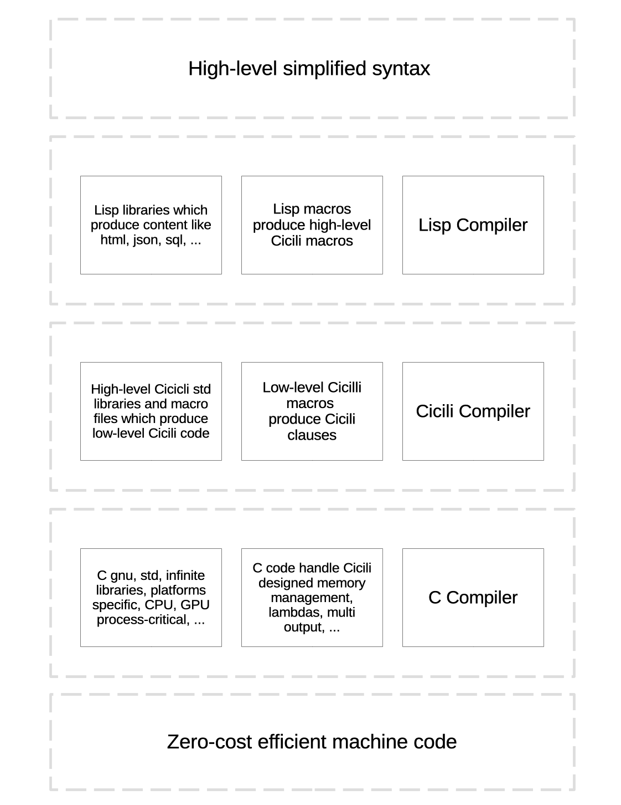

# Cicili – The C Language, in S-expressions

## Overview

The low-level language with a high-level soul.

Cicili is a powerful metaprogramming system built on the expressive foundation of Lisp. It
empowers developers to design domain-specific languages (DSLs), generate efficient C code
through macro expansion, and build high-performance web and system applications. With
Cicili, you can develop modular software components — from dynamic web servers and API
pipelines to automation scripts and embedded systems — while enjoying near-native execution
speed and highly maintainable code.

Lisp C Compiler aka. 'Cicili' programming language compiles Lisp-like syntax to C code, plus
extra features like lambda, closures, deferred execution, RAII-style cleanup, and
function-like macros.



**Lisp is a language for doing what you've been told is impossible.

— Kent Pitman**  [CAVEMAN2](https://8arrow.org/caveman/)

That's such an inspiring quote by Kent Pitman! Lisp truly stands apart from many other
languages by giving you the power to redefine your tools and even the language itself. Its
homoiconicity — the idea that code and data share the same structure — means you can
manipulate code with code. This opens the door to metaprogramming, macros, and the creation
of powerful domain-specific languages that can do things others say are impossible.

**This document covers the C half of Cicili**: every clause that maps onto C, plus the
C-level power features built on top of it — `lambda`, `closure`, `defer`, `alloc`, `auto`,
multi-value returns. The functional layer (`fn`, `data`, `match`, type classes,
Functor / Applicative / Monad) lives in [README.md](../README.md) and the `test/haskell`
folder. Read this file first: everything in the functional layer is built out of the clauses
below.

## Features

* Cicili uses an `IR` (Intermediate Representation) to handle its clauses and features.
* The macro system lets you code in extremely high-order syntax that produces low-level C.
  See [builtins](../builtins.cicili) and [macro.cicili](../test/c/macro.cicili).
* `lambda` writes an in-place function to pass as an argument or as a `defer` destructor.
  See [function.cicili](../test/c/function.cicili).
* `defer` is a variable attribute available in `let` and `var`. It sets how a variable is
  destructed — a lambda or a named function receiving a pointer to the variable. Useful for
  freeing structs or any resource stored inside one. See
  [memory.cicili](../test/c/memory.cicili).
* Auto-deferral releases memory allocated by `alloc` when the variable leaves its `let`
  scope. Note that only functions with a declaration in a `header` and a definition in a
  `source`, or a `static` function in a `source`, can use `defer*`-style capturing deferment.
* `closure` gives a high-level, Lisp-style syntax for the complex C plumbing that closures
  require, making a powerful pattern accessible while still generating efficient C.
* The `auto` type simplifies lambda and function-pointer variables; `typeof` reuses another
  variable's (or expression's) type.
* Inline structs can appear in a variable declaration, a function parameter, or a function
  return type — which is how a function returns multiple values. See
  [function.cicili](../test/c/function.cicili).
* `func` in type position declares a function pointer.
* See [aggregate.cicili](../test/c/aggregate.cicili) for struct samples and
  [control.cicili](../test/c/control.cicili) for control structures.

---

## Clause Index

Every clause below is a list whose head is the clause name. Anything whose head is not a
known clause is compiled as a **function call**.

### Program structure

| clause | what it does | section |
|---|---|---|
| `source` | a target that produces, compiles and links a `.c` file | [Program Structure](#program-structure) |
| `header` | a target that produces a `.h` file; never compiled or linked | [Program Structure](#program-structure) |
| `import` | loads a macro file at read time | [Import](#import) |
| `include` | `#include` | [Include](#include) |
| `guard` | `#ifndef` / `#define` / `#endif` wrapper | [Guard](#guard) |
| `@…` | any preprocessor directive: `@define`, `@ifdef`, `@else`, `@endif`, … | [Preprocessor Forms](#preprocessor-forms) |
| `code` | raw C text, passed through untouched | [Raw C](#raw-c) |
| `DEFMACRO` | defines a Cicili macro (Common Lisp) | [Macros](#macros) |
| `macrolet` | defines macros for one body only | [Macros](#macros) |
| `generic` / `<>` | type-parameterised code, and the name-joining operator | [Macros](#macros) |
| `$$$` | splices a macro's multiple result forms into the enclosing body | [Macros](#macros) |

### Declarations

| clause | what it does | section |
|---|---|---|
| `var` | a global or file-scope variable | [Variable](#variable) |
| `let` / `letn` | scoped variables; `letn` also returns a value | [Scoped Variables](#scoped-variable-declaration-and-initialization) |
| `func` | a function — or, in type position, a function pointer | [Function](#function) |
| `out` | a function's return type; first form after the parameter list | [Function](#function) |
| `struct` | a structure | [Structure](#structure) |
| `union` | a union | [Union](#union) |
| `enum` | an enumeration | [Enum](#enum) |
| `member` | one field of a struct or union | [Structure](#structure) |
| `declare` | the declarator(s) of an anonymous nested struct/union | [Structure](#structure) |
| `typedef` | a type alias | [Typedef](#typedef) |

### Statements

| clause | what it does | section |
|---|---|---|
| `if` | two- or three-part conditional | [Decision Making](#decision-making) |
| `cond` | `if` / `else if` chain | [Decision Making](#decision-making) |
| `switch` / `case` / `default` | C `switch` | [Decision Making](#decision-making) |
| `while` / `do` / `for` | loops | [Loops](#loops) |
| `break` / `continue` | loop and switch control | [Loops](#loops) |
| `block` | `{ … }` compound statement | [Blocks](#blocks-block-and-progn) |
| `progn` | `({ … })` statement expression — has a value | [Blocks](#blocks-block-and-progn) |
| `set` | assignment, one or many pairs | [Assignment](#assignment) |
| `return` | function return | [Function](#function) |

### Expressions

| clause | C equivalent | section |
|---|---|---|
| `nth` | `base[index]` — **index first** | [Array](#array) |
| `?` | `cond ? a : b` | [Operators](#operators) |
| `cast` | `(type)expr` | [Type Casting](#type-casting) |
| `sizeof` / `typeof` | `sizeof(…)` / `typeof(…)` | [Operators](#operators) |
| `aof` / `cof` | `&x` / `*x` | [Operators](#operators) |
| `$` | `a.b` — value member access | [Structure](#structure) |
| `->` | `p->b` — member access through a pointer | [Structure](#structure) |
| `=>` | calls a function stored in a member | [Struct-associated functions](#struct-associated-functions) |
| `lambda` / `lambda*` | a lifted top-level function | [Lambda](#lambda) |
| `'(closure)` / `'(closure*)` | captures the enclosing locals — **GCC only**, clang rejects it | [Closures](#closures) |
| `(closure)` / `def-closure` | captures by value, portable | [Closures](#closures) |
| `alloc` | `malloc` / `calloc` + automatic free | [Dynamic Memory Allocation](#dynamic-memory-allocation) |

### Attributes

An attribute is a parenthesised form written in front of the clause it modifies, and it
applies to **the next clause only**. Several may be stacked: `(extern) (decl) (func …)`.

| attribute | applies to | effect |
|---|---|---|
| `decl` | `func`, `struct` | declaration only, no body |
| `static` | `func`, `var`, `let` binding | `static` |
| `extern` | `func`, `var` | `extern` |
| `inline` | `func` | `__attribute__((weak))` |
| `auto` | `func` | `auto` storage class |
| `register` | `var`, `let` binding | `register` |
| `volatile` | `func`, `var`, `let` binding | `volatile` |
| `thread-local` | `var`, `let` binding | `__thread` |
| `atomic` | `var`, `let` binding | `_Atomic` |
| `defer` | `var`, `let` binding | `__attribute__((__cleanup__(…)))` |
| `non-copy` | `struct` | the type may only be moved, never copied |

---

## Identifiers
> tested in [`test/c/variable.cicili`](../test/c/variable.cicili)


A Cicili name must be a valid C identifier: it starts with a letter or `_` and continues
with letters, digits or `_`. Two characters get special treatment before that check:

* `_` joins the parts of a generic name. `(<> free rc a)` is the symbol `free_rc_a`, and
  that is what reaches C unchanged.

  It used to be `^`, folded to `_` on the way out. Two names for one thing is two chances
  to disagree, and they did: a declaration folded while a `$` member access did not, so
  `($ b (<> find int))` emitted `b . find_int` — which no C compiler accepts — and the
  symbol-table lookup missed as well. Nothing noticed because `lib/std` only ever reached
  its specialisations as free functions, where the folding happened to line up.

Source is read with case preserved, so `Employee` and `employee` are different names, and
Common Lisp forms inside macro files are conventionally written in upper case (`DEFMACRO`,
`LET*`) to keep them visually distinct from Cicili clauses.

```cicili
(var int amount)
(var double total)
(var double * total2)
```
```c
int amount;
double total;
double * total2;
```

## Constants
> tested in [`test/c/types.cicili`](../test/c/types.cicili), [`test/c/string.cicili`](../test/c/string.cicili)


```cicili
(var const int SIDE . 10)
(var const int * SIDE1 . #'(aof SIDE))
(var const int * const SIDE2 . #'(aof SIDE1))
```
```c
const int SIDE = 10;
const int * SIDE1 = &SIDE;
const int * const SIDE2 = &SIDE1;
```

`.` introduces an initializer. `#'( … )` marks the initializer as an *expression* rather
than more type words — without it the reader cannot tell `(var int x . f)` (initialize with
the variable `f`) from a call.

## Operators
> tested in [`test/c/operator.cicili`](../test/c/operator.cicili)


### Arithmetic

cicili | C
------ | ---
`+` | `+`
`-` | `-`
`*` | `*`
`/` | `/`
`%` | `%`

Binary operators are n-ary: `(+ a b c)` is `(a + b + c )`. Every operator expression is
emitted fully parenthesised, so C precedence never surprises you.

```cicili
(set total (+ total amount))

(let ((int i . 3)
      (int j . 7)
      (int k))
  (set k (+ i j)))
```
```c
total = total + amount;

{
  int i = 3;
  int j = 7;
  int k;
  k = i + j;
}
```

### Increment and Decrement

cicili | C
------ | ---
`++` | prefix `++`
`--` | prefix `--`
`1+` | postfix `++`
`1-` | postfix `--`

> `1+` and `1-` are **postfix** `++` / `--`, not Lisp's "add one". Both families take
> exactly one operand.

```cicili
(source "main.c" ()
  (include <stdio.h>)

  (func main ()
    (let ((int a . 5)
          (int b . 5))

      ;; Print them, decrementing each time.
      ;; Postfix for a, prefix for b.

      (printf "\n%d %d" (1- a) (-- b))
      (printf "\n%d %d" (1- a) (-- b))
      (printf "\n%d %d" (1- a) (-- b)))))
```
```c
#include <stdio.h>

int main()
{
  {
    int a = 5;
    int b = 5;

    /* Print them, decrementing each time. */
    /* Postfix for a, prefix for b.        */

    printf("\n%d %d", a--, --b);
    printf("\n%d %d", a--, --b);
    printf("\n%d %d", a--, --b);
  }
}
```

### Relational

cicili | C
------ | ---
`==` | `==`
`!=` | `!=`
`>` | `>`
`<` | `<`
`>=` | `>=`
`<=` | `<=`

### Logical

cicili | C
------ | ---
`and` | `&&`
`or` | `\|\|`
`not` | `!`

### Bitwise

cicili | C
------ | ---
`<<` | `<<`
`>>` | `>>`
`~` | `~`
`bitand` | `&`
`bitor` | `\|`
`xor` | `^`
`^` | `^`

### Assignment

cicili | C
------ | ---
`set` | `=`
`=` | `=`
`+=` | `+=`
`-=` | `-=`
`*=` | `*=`
`/=` | `/=`
`%=` | `%=`
`<<=` | `<<=`
`>>=` | `>>=`

The compound forms take exactly three elements — `(+= x 1)` — and are **statements**. Use
`set` in the ordinary case; see [Assignment](#assignment).

### Conditional

cicili | C
------ | ---
`?` | `?:`

`?` takes exactly four elements; both arms are mandatory.

```cicili
(set a (? (== b 2) 20 30))
```
```c
a = ((b == 2) ? 20 : 30);
```

### Special

cicili | C
------ | ---
`sizeof` | `sizeof()`
`typeof` | `typeof()`
`aof` | `&`
`cof` | `*`
`nth` | `[]`

`sizeof` reads its argument two ways: if it is a **list** it is an expression,
`(sizeof (nth 0 digits))`; otherwise it is a type descriptor, `(sizeof int)`,
`(sizeof const char *)`.

```cicili
(printf "%zu %zu\n" (sizeof int) (sizeof (nth 0 digits)))
```
```c
printf("%zu %zu\n", sizeof(int), sizeof(digits[0]));
```

### Statements are not expressions

Cicili keeps C's split between statements and expressions. `set`, the compound assignments,
`if`, `while`, `for`, `do`, `cond`, `switch`, `return`, `let` and `block` are **statements**
— they cannot appear where a value is required.

When you need a value out of several forms, use **`progn`** or **`letn`**. They are the two
block forms that produce a value. See [Blocks](#blocks-block-and-progn).

## Data Types
> tested in [`test/c/types.cicili`](../test/c/types.cicili)


ANSI C provides three kinds of data type:

* Primary (built-in): `void`, `int`, `char`, `double`, `float`.
* Derived: array, pointer, function pointer.
* User defined: structure, union, enumeration.

Cicili supports declaration and definition of all of them.

cicili | C
------ | ---
`nil` | `NULL`
`void` | `void`
`bool` | `bool`
`char` | `char`
`uchar` | `unsigned char`
`short` | `short`
`ushort` | `unsigned short`
`int` | `int`
`uint` | `unsigned int`
`long` | `long`
`ulong` | `unsigned long`
`llong` | `long long`
`ullong` | `unsigned long long`
`i8` | `int8_t`
`u8` | `uint8_t`
`i16` | `int16_t`
`u16` | `uint16_t`
`i32` | `int32_t`
`u32` | `uint32_t`
`i64` | `int64_t`
`u64` | `uint64_t`
`i128` | `__int128`
`u128` | `unsigned __int128`
`float` | `float`
`double` | `double`
`real` | `long double`
`auto` | `__auto_type`

Any other symbol in type position is passed through to C unchanged, so `size_t`, `FILE`,
`pthread_t` and your own typedefs all work. `lib/std/c` declares the C standard library and
POSIX so type inference knows them — see [lib/std/c/README.md](lib-std-c.md).

### The type descriptor

Every place a type appears — a variable, a parameter, a struct member, a return type, a cast
— uses one grammar, read positionally:

```
[const] TYPE [modifier] [const|restrict] [name] [array]
```

* **modifier** is one of `*`, `**`, `***`, `&` (C++ reference), `move`, `ref`.
* the pointer qualifier slot takes `const` or `restrict`, and requires a `*` modifier.
* **array** is `[]`, `[N]` or `[N][M]`; at most two dimensions.
* the name may be omitted, which is how you declare an unnamed parameter.

```cicili
(const char * restrict format)   ; const char * restrict format
(char * const argv [])           ; char * const argv []
(int)                            ; int          -- unnamed parameter
(Employee ** emp)                ; Employee ** emp
```

`move` and `ref` are ownership markers used by the functional layer: `move` emits nothing at
all, `ref` emits `* restrict`.

## Variable
> tested in [`test/c/variable.cicili`](../test/c/variable.cicili)


```cicili
(source "main.c" ()
        (func main ()
              (let ((double price . 500.4)                         ; atom initialization
                    (double price_array [] . '{100.2 230.7 924.8}) ; list initialization
                    (double price_calc . #'(calculate_price))      ; from a function call
                    (auto identity . '(lambda ((int x)) (out int) (return x))))))) ; lambda
```
```c
int __ciciliL_178 (int x) {
  return x ;
}
int main () {
  {
    double price = 500.4;
    double price_array[] = {100.2, 230.7, 924.8};
    double price_calc = calculate_price ();
    __auto_type identity = __ciciliL_178 ;
  }
}
```

Four initializer forms:

| form | meaning |
|---|---|
| `. 500.4` | an atom |
| `. '{ a b c }` | a brace list — `{ a, b, c }` |
| `. #'( … )` | an expression, usually a call |
| `. '(lambda … )` | a lambda; the value is the generated function's name |

Inside a brace list, an element written `$field` becomes a designated initializer:
`'{ $a x $b y }` is `{ .a = x, .b = y }`.

### Free Variable Declaration and Initialization

A free variable is a global; use `let` for variables inside a function. Attributes:

* `(static)`
* `(extern)`
* `(register)`
* `(volatile)`
* `(thread-local)`
* `(atomic)`
* `(defer …)`

```cicili
(register) (var int height . 5)
(var char letter . #\A)
(var float age)
(extern) (var float area)
(static) (var double d)
(thread-local) (var int slot)

;; actual initialization
(set age 26.5)
```
```c
register int height = 5;
char   letter = 'A';
float  age;
extern float area;
static double d;
__thread int slot;

/* actual initialization */
age = 26.5;
```

> `(auto)` is **not** a variable attribute. In Cicili `auto` is a *type* — `__auto_type` —
> not a storage class. It is accepted as an attribute on `func` only.

### Scoped Variable Declaration and Initialization

`let` opens a scope and declares variables in it. Attribute markers appear as bare lists
inside the binding list and apply to **the binding that follows**:

* `(static)`
* `(register)`
* `(volatile)`
* `(thread-local)`
* `(atomic)`
* `(defer …)` — a destructor, see [Deferred cleanup](#deferred-cleanup)

```cicili
(source "main.c" ()
        (func main ()
              (let ((static) (int width . 3)
                    (register) (int height . 4)
                    (defer () (free (-> emp Name))
                              (free emp)
                              (printf "from defer, emp is freed\n"))
                    (Employee * emp . #'(alloc (sizeof Employee))))
                (printf "area: %d" (* width height)))))
```
```c
static void __ciciliL_105 (Employee ** emp_ptr) {
  Employee * emp = (*emp_ptr);
  free ((emp -> Name));
  free (emp);
  printf ("from defer, emp is freed\n");
}
int main () {
  { /* cicili#Let104 */
    static int width = 3;
    register int height = 4;
    Employee * emp __attribute__((__cleanup__(__ciciliL_105))) = ((Employee *)malloc (sizeof(Employee)));
    // ----------
    printf ("area: %d", (width * height));
  }
}
```

Note what the destructor looks like: the parameter is a pointer to the variable, and the
compiler **rebinds the variable's own name and type** on the first line, so the body you
write reads exactly like the code around it.

**`let` vs `letn`** — same bindings, same scoping, one difference:

| | `let` | `letn` |
|---|---|---|
| C form | `{ … }` | `({ … })` — a GCC statement expression |
| has a value | no | yes: the last body form |
| usable as an expression | no | yes |

`letn` is how you introduce locals in the middle of an expression:

```cicili
(printf "%d\n" (letn ((int a . 2) (int b . 3)) (* a b)))
```
```c
printf ("%d\n", ({ int a = 2; int b = 3; (a * b); }));
```

> Generated code carries provenance comments — `{ /* cicili#Let104 */`, `/* cicili#Block106 */`,
> `/* cicili#Progn123 */` — and a `// ----------` line between a `let`'s declarations and its
> body. They are harmless, and they make the mapping from C back to Cicili obvious when you
> read the output.

### `auto` and `typeof`

`auto` asks the compiler to infer a variable's type from its initializer. When inference
succeeds the real type is written into the C output; when it cannot, `__auto_type` is
emitted and GCC/Clang finishes the job. Use it for function pointers, lambdas and closures,
whose types are tedious or impossible to spell.

`typeof` names a type by pointing at an expression. The expression is never evaluated, so
dummy arguments are idiomatic.

```cicili
(var auto u2 . 1)
(var (typeof u2) u3 [1])
(var int u4 [] . '{ 2 3 })
(var (typeof (nth 0 u4)) u5 [2] . '{ 4 5 })
```
```c
int u2 = 1;
int u3 [1];
int u4 [] = { 2, 3 };
typeof(u4[0]) u5 [2] = { 4, 5 };
```

An `auto` variable may only take a *named* function as its `defer` destructor, and a
function declared `(out auto)` must contain a `return`.

### Assignment

```cicili
(set width 60)
(set age 35)
(set width 65 age 40) ; multi assignment
```
```c
width = 60;
age = 35;
width = 65;
age = 40;
```

`set` takes any even number of arguments and assigns them **in order** — `(set a b b a)`
does not swap.

```cicili
(source "main.c" ()
  (include <stdio.h>)

  (func main ()
    (let ((int age . 33))
      (printf "I am %d years old.\n" age))))
```
```c
#include <stdio.h>

int main()
{
  {
    int age = 33;
    printf("I am %d years old.\n", age);
  }
}
```

## Type Casting
> tested in [`test/c/types.cicili`](../test/c/types.cicili), [`test/c/aggregate.cicili`](../test/c/aggregate.cicili)


```cicili
(source "main.c" ()
  (include <stdio.h>)
  (func main ()
    (let ((float a))
      (set a (cast float (/ 15 6)))
      (printf "%f" a))))
```
```c
#include <stdio.h>
int main ()
{
  {
    float a;
    a = ((float)(15 / 6));
    printf("%f", a);
  }
}
```

The type slot accepts a full type descriptor, so `(cast (Employee *) p)`,
`(cast (const char * const) s)` and `(cast (typeof x) y)` all work. A `code` clause is
accepted too, for a type Cicili has no spelling for.

## Program Structure
> tested in [`test/c/shared.cicili`](../test/c/shared.cicili), [`test/c/library.cicili`](../test/c/library.cicili)


A Cicili program is one or more **targets**. Each target names a C file and a list of
features, and translates its clauses into that file. `header` targets compile their content
and are never handed to the C compiler; `source` targets are
resolved, compiled and linked.

### Targets

```cicili
(source "path/to/file.c" (:key value …) clause…)
(header "path/to/file.h" (:key value …) clause…)
```

The feature list must have an even number of elements. It is macro-expanded first, so a
macro may produce it — see the `make` macro in [builtins.cicili](../builtins.cicili).

### Features

Every feature may be omitted. `#t` selects the default behaviour, `#f` does nothing.

* **`:std`** — writes the standard library includes at the top of the file.

```cicili
(source "main.c"
  (:std #t)
  ;; some forms
  )
```
```c
#include <stdio.h>
#include <stddef.h>
#include <stdint.h>
#include <stdlib.h>
#include <string.h>
#include <stdbool.h>
```

  Under `:cpp #t` it emits `<string>` and `<iostream>` instead.

* **`:compile`** — compiles the target file. The default is `-c target.c`. A string or list
  is passed to the compiler configured in `config.lisp`. **A custom `:compile` must contain
  `-c` or `--compile`**; the argument right after it is replaced with the target file name.
* **`:link`** — links the target as a library or an executable. There is no default
  behaviour; a string or list is passed to the linker from `config.lisp`. `:link` only runs
  if `:compile` appears **before** it in the feature list and succeeded.
* **`:cpp`** — use the C++ compiler and linker from `config.lisp`. See
  [C++ Compiler](#c-compiler).
* **`:haskell`** — includes `haskell.h` and adds the runtime's include/link flags.

Two placeholders are substituted in `:compile` and `:link`:

* `{$CWD}` — the current working directory.
* `{$CCL}` — the Cicili installation directory.

```cicili
;; MyMath library declaration
(header "mymath.h"
  (:compile #f)

  (guard __MYMATH_H__
    (decl) (func obj1_does ((int) (int)) (out int))
    (decl) (func obj2_does ((int) (int)) (out int))
    (decl) (func obj3_does ((int) (int)) (out int))))

;; Default compilation
(source "obj1.c"
  (:compile #t)
  (include "mymath.h")
  (func obj1_does ((int x) (int y)) (out int)
	    (return (+ x y))))

;; Custom compilation
(source "obj2.c"
  (:compile "-c obj2.c -o objmul.lo")
  (include "mymath.h")
  (func obj2_does ((int x) (int y)) (out int)
	    (return (* x y))))

;; Library creation and linking
(source "obj3.c"
  (:compile #t :link "-o libMyMath.la -L{$CWD} obj1.lo objmul.lo obj3.lo")
  (include "mymath.h")
  (func obj3_does ((int x) (int y)) (out int)
	    (return (obj1_does (obj2_does x y) (obj2_does x y)))))

;; Executable creation and linking
(source "main.c"
  (:std #t :compile #t :link "-o CompileTest -L{$CWD} main.lo -lMyMath")
  (include "mymath.h")
  (func main ((int argc) (char * argv []))
	    (if (!= argc 3)
		    (block
		        (printf "two digits needed!")
		      (return EXIT_FAILURE)))
	    (let ((int x . #'(atoi (nth 1 argv)))
		      (int y . #'(atoi (nth 2 argv))))
	      (printf "MyMath lib outputs: %d\n" (obj3_does x y)))
	    (return EXIT_SUCCESS)))
```
```
cicili % sbcl --script cicili.lisp test/test.cicili
software type: "Darwin"
arg specified: test/mylib.cicili
cicili: specifying target mymath.h
cicili: resolving target mymath.h
cicili: specifying target obj1.c
cicili: resolving target obj1.c.run1.c
run out 1 > glibtool: compile:  clang -g -O "" -c obj1.c.run1.c -o obj1.c.run1.o
cicili: compiling target obj1.c
glibtool: compile:  clang -g -O "" -c obj1.c -o obj1.o
cicili: specifying target obj2.c
cicili: compiling target obj2.c
glibtool: compile:  clang -g -O "" -c obj2.c -o objmul.o
cicili: specifying target obj3.c
cicili: compiling target obj3.c
glibtool: link: ar cr .libs/libMyMath.a .libs/obj1.o .libs/objmul.o .libs/obj3.o
cicili: specifying target main.c
cicili: compiling target main.c
glibtool: link: clang -g -O "" -o CompileTest .libs/main.o -L{$CWD} libMyMath.a
```

### Sections

* **Documentation** — anything after `;`. The convention is `;;;;` for a file, `;;;` for a
  target, `;;` for a block, and a trailing `;` for one form.

```cicili
;;;; about a cicili file
;;; author, licence and/or documentation about each target
(var long height) ; description of a form
(func sqr ((double a))
  (out double)
  ;; some commented code or documentation inside code
  (return (* a a)))
```

* **Preprocessor forms** — see [Preprocessor Forms](#preprocessor-forms).
* **Main function** — every program has exactly one. `(main …)` and `(main* …)` are macros
  for the two usual shapes:

```cicili
(main (printf "hello\n") (return 0))
(main* (printf "%s\n" (nth 0 argv)) (return 0))
```
```c
int main () { printf ("hello\n"); return 0; }
int main (int argc, char * argv []) { printf ("%s\n", argv[0]); return 0; }
```

### Include
> tested in [`test/c/shared.cicili`](../test/c/shared.cicili)


`include` takes one or more headers. A symbol prints bare, a string prints quoted.

```cicili
(include <stdio.h> <stdlib.h> "basic.h")
```
```c
#include <stdio.h>
#include <stdlib.h>
#include "basic.h"
```

### Import
> tested in [`test/c/macro.cicili`](../test/c/macro.cicili)


`import` loads a **macro file** — a file of `DEFMACRO`, `DEFUN` and `generic` definitions,
plus further imports. It runs while your file is being read, before any target is specified.

```cicili
(import "lib/std/prelude.cicili")   ; from the cicili installation directory
(import "./mymacros.cicili")        ; relative to this file
(import "/opt/shared/macros.cicili"); absolute
```

Path resolution is decided by the first character: `.` means relative to the importing file,
`/` means an absolute path, anything else is resolved against the Cicili installation
directory.

### Guard
> tested in [`test/c/shared.cicili`](../test/c/shared.cicili)


```cicili
(guard __STUDENT_H__
  (struct Student
    (member char name [50])
    (member char family [50])
    (member int  class_no)))
```
```c
#ifndef __STUDENT_H__
#define __STUDENT_H__
typedef struct Student {
  char name [50];
  char family [50];
  int class_no;
} Student;
#endif /* __STUDENT_H__ */
```

A guard body accepts everything a target accepts, so a whole header can live inside one.

### Preprocessor Forms
> tested in [`test/c/preprocess.cicili`](../test/c/preprocess.cicili)


Any clause whose head starts with `@` becomes a preprocessor directive of the same name.
It takes at most two arguments, and the payload is normally a `code` clause, because `code`
passes text through untouched.

```cicili
(@define (code "SHA1_ROTL(bits, word) (((word) << (bits)) | ((word) >> (32-(bits))))"))

(struct SHA512Context
  (@ifdef USE_32BIT_ONLY)
  (member uint32_t Intermediate_Hash[(/ SHA512HashSize 4)]) ; Message Digest
  (member uint32_t Length[4])                               ; Message length in bits
  (@else)                                                   ; !USE_32BIT_ONLY
  (member uint64_t Intermediate_Hash[(/ SHA512HashSize 8)]) ; Message Digest
  (member uint64_t Length_High)
  (member uint64_t Length_Low)                              ; Message length in bits
  (@endif)                                                  ; USE_32BIT_ONLY
  (member int_least16_t Message_Block_Index)                ; Message_Block array index
  (member uint8_t Message_Block[SHA512_Message_Block_Size]) ; 1024-bit message blocks
  (member int Computed)                                     ; Is the hash computed?
  (member int Corrupted))                                   ; Cumulative corruption code
```
```c
#define SHA1_ROTL(bits, word) (((word) << (bits)) | ((word) >> (32-(bits))))

typedef struct SHA512Context {
#ifdef USE_32BIT_ONLY
  uint32_t Intermediate_Hash [SHA512HashSize / 4];
  uint32_t Length [4];
#else
  uint64_t Intermediate_Hash [SHA512HashSize / 8];
  uint64_t Length_High;
  uint64_t Length_Low;
#endif
  int_least16_t Message_Block_Index;
  uint8_t Message_Block [SHA512_Message_Block_Size];
  int Computed;
  int Corrupted;
} SHA512Context;
```

Preprocessor forms are legal at target level and inside `guard`, `struct`, `union` and
function bodies.

### Raw C
> tested in [`test/c/preprocess.cicili`](../test/c/preprocess.cicili)


`code` emits its argument verbatim. It is valid as an expression, as a statement, and in
type position.

```cicili
(code "__builtin_unreachable()")
(cast (code "struct sockaddr *") p)
```

## Decision Making
> tested in [`test/c/control.cicili`](../test/c/control.cicili)


### if

`if` takes a condition, a then-form, and an optional else-form. **Each branch is exactly one
form** — use `block` for several.

```cicili
(let ((int a . 5)
      (int b . 6))
  (if (> a b)
     (printf "a is greater")
    (printf "maybe b is greater")))
```
```c
{
  int a = 5;
  int b = 6;
  if (a > b)
    printf("a is greater");
  else
    printf("maybe b is greater");
}
```

```cicili
(let ((int a . 5)
      (int b . 6))
  (if (> a b)
     (block
       (printf "a is greater")
       (set a (* a b)))
    (block
      (printf "maybe b is greater")
      (set b (* b a)))))
```
```c
{
  int a = 5;
  int b = 6;
  if (a > b) {
    printf("a is greater");
    a = a * b;
  } else {
    printf("maybe b is greater");
    b = b * a;
  }
}
```

### cond

`cond` is an `if` / `else if` chain. Unlike `if`, each clause body may hold any number of
forms, and every body is braced.

```cicili
(cond ((== x 1) (printf "x is 1\n"))
      ((== x 2) (printf "x is 2\n")
                (set x 0))
      (#t       (printf "x is ?\n")))
```
```c
if (x == 1) {
  printf ("x is 1\n");
}
else if (x == 2) {
  printf ("x is 2\n");
  x = 0;
}
else if (true) {
  printf ("x is ?\n");
}
```

> `cond` has **no default clause**. A trailing `(#t …)` compiles to `else if (true)`, which
> needs `<stdbool.h>` — i.e. `:std #t`.

### switch

```cicili
(let ((int a))
  (printf "Please enter a number between 1 and 5: ")
  (scanf "%d" (aof a))

  (switch a
    (case 1 (printf "You chose One")   break)
    (case 2 (printf "You chose Two")   break)
    (case 3 (printf "You chose Three") break)
    (case 4 (printf "You chose Four")  break)
    (case 5 (printf "You chose Five")  break)
    (default (printf "Invalid Choice."))))
```
```c
{
  int a;
  printf("Please enter a number between 1 and 5: ");
  scanf("%d", &a);

  switch (a) {
    case 1:
      printf("You chose One");
      break;
    case 2:
      printf("You chose Two");
      break;
    case 3:
      printf("You chose Three");
      break;
    case 4:
      printf("You chose Four");
      break;
    case 5:
      printf("You chose Five");
      break;
    default:
      printf("Invalid Choice");
  }
}
```

Every child of a `switch` must be a `case` or a `default`. **No `break` is inserted for
you** — cases fall through exactly as in C, which is why every branch above ends with an
explicit `break`.

## Loops
> tested in [`test/c/control.cicili`](../test/c/control.cicili)


### while

```cicili
(let ((int n . 1)
      (int times . 5))
  (while (<= n times)
    (printf "cicili while loops: %d\n" n)
    (1+ n)))
```
```c
{
  int n = 1;
  int times = 5;

  while (n <= times) {
      printf("cicili while loops: %d\n", n);
      n++;
  }
}
```

### do

```cicili
(let ((int n . 1)
      (int times . 5))
  (do
    (printf "cicili do loops: %d\n" n)
    (1+ n)
    (<= n times))) ; the LAST form of do is the condition
```
```c
{
  int n = 1;
  int times = 5;

  do {
      printf("cicili do loops: %d\n", n);
      n++;
  } while (n <= times);
}
```

> The last form of `do` is the loop condition, not a body statement.

### for

`for` takes an initializer list, a test, a **list** of step forms, and a body.

```cicili
(let ((int n)
      (int times))
  (for ((n . 1)
        (times . 5))     ; initialize
       (<= n times)      ; test
       ((1+ n))          ; step -- a list of forms
    (printf "cicili for loop: %d\n" n)))

(for ((int n . 1)
      (int times . 2))   ; initialize, declaring as you go
     (<= n times)        ; test
     ((1+ n))            ; step
  (printf "another initialization for loop: %d\n" n))
```
```c
{
  int n;
  int times;
  for (n = 1, times = 5; (n <= times); (n ++)) {
    printf ("cicili for loop: %d\n", n);
  }
}
for (int n = 1, times = 2; (n <= times); (n ++)) {
  printf ("another initialization for loop: %d\n", n);
}
```

An initializer written `(name . value)` assigns to an existing variable; written
`(type name . value)` it declares a new one. The step list accepts only simple forms:
atoms, unary operators, assignments, `set`, and calls.

### break and continue

Both are bare symbols, usable anywhere C allows them.

```cicili
(while (!= c EOF)
  (if (== c #\Space) continue)
  (if (== c #\Newline) break)
  (1+ count))
```

## Blocks: `block` and `progn`
> tested in [`test/c/control.cicili`](../test/c/control.cicili)


| | `block` | `progn` |
|---|---|---|
| C form | `{ … }` compound statement | `({ … })` GCC statement expression |
| has a value | no | yes — the last form |
| usable as an expression | no | yes |
| portability | ISO C | GCC / Clang extension |

```cicili
(block
  (printf "step one\n")
  (printf "step two\n"))

(printf "%d\n" (progn (printf "side effect\n") 42))
```
```c
{
  printf ("step one\n");
  printf ("step two\n");
}

printf ("%d\n", ({ printf ("side effect\n"); 42; }));
```

`block` is what you reach for to put several statements in an `if` branch. `progn` and
`letn` are what you reach for when an expression needs several steps.

## Function
> tested in [`test/c/function.cicili`](../test/c/function.cicili)


Points to know:

* `out` sets the return type and must be the **first form after the parameter list**. A
  function with no `out` returns `void` — except `main`, which returns `int`.
* Attributes are set at declaration time, each in its own parentheses:
  * `(decl)` — declaration only, no body
  * `(static)`
  * `(inline)` — emits `__attribute__((weak))`
  * `(extern)`
  * `(auto)`
  * `(volatile)`
  * `(resolve #f)` — do not resolve this function

```cicili
(source "main.c"
  (:std #t :compile #t :link #t)

  ;; function declaration
  (decl) (func addition ((int * a) (int * b)) (out int))

  (func main ()
        ;; local variable definition
        (let ((int answer)
              (int num1 . 10)
              (int num2 . 5)
              (func aFuncPtr ((int * _) (int * _)) (out int) . addition)) ; function pointer

          ;; calling a function to get addition value
          (set answer (addition (aof num1) (aof num2)))
          (printf "The addition of two numbers is: %d\n" answer)

          (set answer (aFuncPtr (aof num1) (aof num2)))
          (printf "The addition of two numbers by function pointer is: %d\n" answer))

        (return 0))

  ;; function returning the addition of two numbers
  (func addition ((int * a) (int * b))
        (out int)
        (return (+ (cof a) (cof b)))))
```
```c
#include <stdio.h>
#include <stddef.h>
#include <stdint.h>
#include <stdlib.h>
#include <string.h>
#include <stdbool.h>
int addition (int * a, int * b);
int main () {
  {
    int answer;
    int num1 = 10;
    int num2 = 5;
    int (*aFuncPtr) (int * , int * ) = addition;
    answer  = addition ((&num1), (&num2));
    printf ("The addition of two numbers is: %d\n", answer);
    answer  = aFuncPtr ((&num1), (&num2));
    printf ("The addition of two numbers by function pointer is: %d\n", answer);
  }
  return 0;
}
int addition (int * a, int * b) {
  return ((*a) +  (*b));
}
```

### Parameters

A parameter is a type descriptor. Three shapes are worth naming:

```cicili
(func f ((int) (int)) (out int))              ; unnamed parameters, for a declaration
(func g ((const char * restrict fmt) ($$$)))  ; ($$$) is C's ...
(func h ((func cmp ((int a) (int b)) (out int))))  ; a function-pointer parameter
```
```c
int f (int, int);
void g (const char * restrict fmt, ...);
void h (int (*cmp) (int a, int b));
```

### Function pointers

A `func` clause **in type position** is a function pointer. It is spelled exactly like a
function declaration, and works as a parameter, a struct member, or a variable:

```cicili
(var func handler ((int sig)) . my_handler)
(member func resolve ((char * prob)) (out char *))
(cast (func _ ((void * args)) (out int)) p)
```
```c
void (*handler) (int sig) = my_handler;
char * (*resolve) (char * prob);
((int (*) (void * args))p)
```

Use `_` as the pointer's name to get an unnamed `(*)`.

For an **array** of function pointers the `[]` goes after the name and before the
parameter list, the same place it sits on any other variable:

```cicili
(let ((func ops [] ((int a) (int b)) (out int) . '{ add sub }))
  (printf "%d\n" ((nth 1 ops) 20 22)))
```
```c
int (*ops[]) (int a, int b) = { add, sub };
printf ("%d\n", ops [1](20, 22));
```

### Returning multiple values

An **inline struct** in `out` position lets a function return several values. Its members
are bare declarators — no `member` keyword.

```cicili
(source "main.c" (:std #t :compile #t :link #t)
        (static) (func aMultiReturnFunc ((int x) (int y)) (out '{(int a) (int b)})
                       (return '{ x y }))

        (static) (func aMultiReturnFuncS ((int x) (int y)) (out '{(int a) (int b)})
                       (let (((typeof (aMultiReturnFuncS x y)) s . '{ x y }))
                         (return s)))

        (func main ()
              (let ((int n . 3)
                    (int t . 4)
                    ((typeof (aMultiReturnFunc 1 1)) mr)
                    ((typeof (aMultiReturnFuncS 1 1)) mrt))
                (set mr (aMultiReturnFunc n t))
                (printf "a: %d, b: %d\n" ($ mr a) ($ mr b))
                (set mrt (aMultiReturnFuncS (++ n) (++ t)))
                (printf "a: %d, b: %d\n" ($ mrt a) ($ mrt b)))))
```
```c
typedef struct __ciciliS_aMultiReturnFunc_ {
  int a;
  int b;
} __ciciliS_aMultiReturnFunc_;
static struct __ciciliS_aMultiReturnFunc_ aMultiReturnFunc (int x, int y) {
  return ((struct __ciciliS_aMultiReturnFunc_){x , y});
}
typedef struct __ciciliS_aMultiReturnFuncS_ {
  int a;
  int b;
} __ciciliS_aMultiReturnFuncS_;
static struct __ciciliS_aMultiReturnFuncS_ aMultiReturnFuncS (int x, int y) {
  {
    typeof(aMultiReturnFuncS (x , y)) s = {x , y};
    return ((struct __ciciliS_aMultiReturnFuncS_)s);
  }
}
int main () {
  {
    int n = 3;
    int t = 4;
    typeof(aMultiReturnFunc (1, 1)) mr;
    typeof(aMultiReturnFuncS (1, 1)) mrt;
    mr = aMultiReturnFunc (n , t);
    printf ("a: %d, b: %d\n", (mr . a), (mr . b));
    mrt = aMultiReturnFuncS ((++n ), (++t ));
    printf ("a: %d, b: %d\n", (mrt . a), (mrt . b));
  }
}
```

Two rules come with it:

1. You cannot spell the generated type, so you name it with `typeof` applied to a call. The
   arguments inside `typeof` are dummies — nothing is evaluated.
2. **A multi-returning function must be `(static)` in a source target, or declared `(decl)`
   in a header target and defined in a source target.** Otherwise the generated struct never
   reaches the callers.

### Struct-associated functions
> tested in [`test/c/aggregate.cicili`](../test/c/aggregate.cicili)


A function that belongs to a type is an ordinary `func` that takes the value as its first
parameter. The name ties it to the type, and `<>` builds that name out of parts so the same
code can be generated for many types:

```cicili
(struct Employee
  (member int id)
  (member char * name))

(func (<> toString Employee) ((Employee * employee) (FILE * file))
      (fprintf file "#%d %s\n" (-> employee id) (-> employee name)))

(main
  (let ((Employee e . '{ $id 1 $name "Ada" }))
    ((<> toString Employee) (aof e) stdout)))
```
```c
void toString_Employee (Employee * employee, FILE * file) {
  fprintf (file, "#%d %s\n", (employee -> id), (employee -> name));
}
int main () {
  {
    Employee e = { .id = 1, .name = "Ada" };
    toString_Employee ((&e), stdout);
  }
}
```

`(<> toString Employee)` is the symbol `toString_Employee`, and that is the C name — see
[Macros](#macros). Inside a `generic` the type part is a parameter, which is how
`lib/std/vector.cicili` writes one `free` that works for `(<> vector int)`,
`(<> vector char)` and everything else:

```cicili
(generic decl-vector (a)
  (struct (<> vector a)
          (member (<> rc (<> array a)) vec)
          (member size_t low)
          (member size_t high))

  (inline)
  (func (<> free (<> vector a)) (((<> vector a) * vector))
        ((<> free rc (<> array a)) (aof (-> vector vec)))))
```

Three access operators:

| operator | meaning |
|---|---|
| `($ obj member)` | `obj.member` — value member access; chains: `($ a b c)` is `a.b.c` |
| `(-> ptr member)` | `ptr->member` |
| `(=> obj member arg…)` | calls a function **stored in** a member |

`=>` is for a member that holds a function pointer — `(member func resolve ((char * prob)) (out char *))`
is called with `(=> emp resolve "why")`. It is also how C++ member functions are called under
`:cpp #t`.

`=>` takes **one** level of access, and it resolves the member name in the type of the
object you give it. To reach a member of a nested struct, hand it that struct:

```cicili
(=> ($ emp duty) describe 6)     ; not (=> emp duty describe 6)
```

### Lambda
> tested in [`test/c/function.cicili`](../test/c/function.cicili)


A lambda is a quoted `lambda` form. It is lifted to a top-level C function named
`__ciciliL_<n>`, and the expression's value is that function's name — so it works as an
argument, an initializer, or a `defer` destructor.

```cicili
(let ((auto inc . '(lambda ((int x)) (out int) (return (+ x 1)))))
  (printf "%d\n" (inc 41)))
```
```c
int __ciciliL_1042 (int x) {
  return (x + 1);
}
…
{
  int (*inc) (int x) = __ciciliL_1042;
  printf ("%d\n", inc (41));
}
```

`auto` reads the binding two ways, and the difference is whether the lambda is *called*:

| written | `inc` is | C type |
|---|---|---|
| `(auto inc . '(lambda ((int x)) (out int) …))` | the function | `int (*inc) (int x)` |
| `(auto n . #'('(lambda ((int x)) (out int) …) 41))` | what the call returned | `int n` |

You can always write the pointer type out instead of `auto`, which is the same thing:

```cicili
(let ((func inc ((int x)) (out int) . '(lambda ((int x)) (out int) (return (+ x 1)))))
  (printf "%d\n" (inc 41)))
```

`'(lambda* NAME (params) …)` is the same thing with a name you choose.

Because a lambda is lifted to file scope it **cannot capture** the enclosing function's
locals. When you need capture, use a closure.

### Closures
> tested in [`test/c/function.cicili`](../test/c/function.cicili)


```cicili
'(closure  (param…) (out TYPE)? body…)
'(closure* NAME (param…) (out TYPE)? body…)
```

> **GCC only.** A quoted closure becomes a **GCC nested function**, an extension clang has
> never implemented — it answers `error: function definition is not allowed here`. On a
> clang toolchain (which is what `config.lisp` names on macOS) these two forms cannot be
> used at all. Everything else in this section, and the `closure` macro below, is portable.

A closure becomes a GCC nested function inside a statement expression, so it *can* read the
enclosing function's locals:

```cicili
(let ((int n . 10)
      (auto add_n . '(closure ((int x)) (out int) (return (+ x n)))))
  (printf "%d\n" (add_n 5)))
```
```c
{
  int n = 10;
  __auto_type add_n = ({
    int __ciciliC_1121 (int x) {
      return (x + n);
    }
    __ciciliC_1121 ;
  });
  printf ("%d\n", add_n (5));
}
```

#### The `closure` macro — the portable one

Unquoted, `closure` is a different thing entirely, and the one to reach for on clang:

```cicili
(closure (NAME :capture value …) (out TYPE)? body…)
```

It is a named lambda at file scope, called immediately with the captured values passed as
ordinary arguments — each parameter's type is inferred from the value it captures, so only
the name is written:

```cicili
(let ((int base . 40))
  (printf "%d\n" (closure ((<> cl demo) :base (aof base))
                   (out int)
                   (return (+ (cof base) 2)))))
```

It expands to `('(lambda* NAME (inferred params…) body…) values…)`. Capture is by value —
capture an address, as above, when the body must reach the original. This is what every
`let^…` / `take^…` macro in `lib/std` is built on, and it is covered by
[function.cicili](../test/c/function.cicili).

For a closure that must outlive its scope — handed to a thread, stored in an event loop —
use `def-closure`, which copies the captured values into a struct:

```cicili
(def-closure ((int * state_counter))
  '(lambda ((Coroutine * ctx)) (out int)
     (++ (cof state_counter))
     (return 0)))
```

It generates a context struct holding a `routine` function pointer plus the captures, and
evaluates to a value of that struct. Call it with `(exec-closure c args…)`, which expands to
`c.routine(&c, args…)`. Because it is a plain struct value it can be `memcpy`'d onto the
heap — this is exactly how `lib/std/pthread` implements `go`.

## Array
> tested in [`test/c/string.cicili`](../test/c/string.cicili)


### Define

```cicili
(var double amount [5])
```

### Initialize

```cicili
(var int digits [] . '{ 1 2 3 4 5 })
(var char hw [][6] . '{ "Hello" "World" })
```
```c
int digits[] = {1, 2, 3, 4, 5};
char hw[][6] = { "Hello", "World" };
```

### Subscript

`nth` takes the **index first**, then the base — the reverse of C.

```cicili
(var int myArray [5])

;; Initializing elements of the array separately
(for ((int n . 0))
     (< n (/ (sizeof myArray) (sizeof int)))
     ((1+ n))
  (set (nth n myArray) n))
```
```c
int myArray[5];

/* Initializing elements of the array separately */
for (int n = 0; n < sizeof(myArray) / sizeof(int); n++)
{
  myArray[n] = n;
}
```

## String
> tested in [`test/c/string.cicili`](../test/c/string.cicili)


```cicili
(var char name [6] . '{#\C #\l #\o #\u #\d #\Null})
(var char name []  . "Cloud")
(var char * name   . "Cloud")
```
```c
char name[6] = {'C', 'l', 'o', 'u', 'd', '\0'};
char name[]  = "Cloud";
char * name  = "Cloud";
```

C escape sequences inside a string literal pass through unchanged, so `"%d\n"` means what
you expect.

### Special Characters

cicili | C
------ | ---
`#\Null` | `'\0'`
`#\Space` | `' '`
`#\Newline` | `'\n'`
`#\Linefeed` | `'\n'`
`#\Return` | `'\r'`
`#\Tab` | `'\t'`
`#\Backspace` | `'\b'`
`#\Page` | `'\v'`
`#\Rubout` | `'\x7F'`

Any other character prints as itself: `#\A` is `'A'`.

## Pointer
> tested in [`test/c/memory.cicili`](../test/c/memory.cicili)


```cicili
(var int * width)
(var char * letter)
```
```c
int  *width;
char *letter;
```

```cicili
(source "main.c" ()
  (include <stdio.h>)

  (func main ((int argc) (char * argv []))
    (let ((int n . 20)
          (int * pntr))  ; actual and pointer variable declaration
      (set pntr (aof n)) ; store address of n in the pointer variable
      (printf "Address of n variable: %x\n" (aof n))

      ;; address stored in the pointer variable
      (printf "Address stored in pntr variable: %x\n" pntr)

      ;; access the value using the pointer
      (printf "Value of *pntr variable: %d\n" (cof pntr)))
    (return 0)))
```
```c
#include<stdio.h>

int main (int argc, char *argv[])
{
  {
    int n = 20;
    int *pntr;          /* actual and pointer variable declaration */
    pntr = &n;          /* store address of n in pointer variable  */
    printf("Address of n variable: %x\n", &n);

    /* address stored in pointer variable */
    printf("Address stored in pntr variable: %x\n", pntr);

    /* access the value using the pointer */
    printf("Value of *pntr variable: %d\n", *pntr);
  }
  return 0;
}
```

## Dynamic Memory Allocation
> tested in [`test/c/memory.cicili`](../test/c/memory.cicili), [`test/std/defer.cicili`](../test/std/defer.cicili)


C's `malloc()`, `calloc()`, `realloc()` and `free()` are available directly. On top of them
Cicili adds `alloc`, which casts for you and installs an automatic `free`, and `defer`,
which lets you attach any destructor to any variable.

```cicili
(let ((char * mem_alloc . #'(malloc (* 15 (sizeof char))))) ; allocated by hand
  (if (== mem_alloc nil) (printf "Couldn't allocate the requested memory\n"))
  (free mem_alloc))
```
```c
{
  char * mem_alloc = malloc(15 * sizeof(char)); /* allocated by hand */
  if (mem_alloc == NULL) {
    printf("Couldn't allocate the requested memory\n");
  }
  free(mem_alloc);
}
```

### alloc

| form | C |
|---|---|
| `#'(alloc SIZE)` | `((T *)malloc(SIZE))` |
| `#'(alloc COUNT SIZE)` | `((T *)calloc(COUNT, SIZE))` |

The cast is built from the variable's own declared type, so it always matches. An
`alloc`-initialized variable with no explicit `defer` **automatically gets one** that frees
it at the end of the scope.

```cicili
(func main ()
      (let ((defer () (printf "x was %d\n" (cof x)))
            (int x . 6)
            (int * ax . #'(alloc 5 (sizeof int))))
        (printf "x is %d\n" x)))
```
```c
void __ciciliL_178 (int * x) {
  printf("x was %d\n", (*x));
}
void __ciciliL_179 (int ** ax) {
  free (((void *)(*ax)));
}
int main () {
  {
    int x __attribute__((__cleanup__(__ciciliL_178))) = 6;
    int * ax __attribute__((__cleanup__(__ciciliL_179))) = ((int *)calloc(5, sizeof(int)));
    printf("x is %d\n", x);
  }
}
```

```cicili
(let ((int n_rows . 4)
      (int n_columns . 5)
      (int ** matrix . #'(alloc (* (* n_rows n_columns) (sizeof int)))))
  (printf "Matrix allocated\n"))
```
```c
void __ciciliL_178 (int *** matrix) {
  free (((void *)(*matrix)));
}
int main () {
  {
    int n_rows = 4;
    int n_columns = 5;
    int ** matrix __attribute__((__cleanup__(__ciciliL_178))) = ((int **)malloc(((n_rows * n_columns) * sizeof(int))));
    printf ("Matrix allocated\n");
  }
}
```

### Deferred cleanup

> tested in [`test/c/memory.cicili`](../test/c/memory.cicili), [`test/std/defer.cicili`](../test/std/defer.cicili)

`defer` is an attribute on the **next** binding. Three spellings, and only three:

| form | meaning |
|---|---|
| `(defer #t)` | pure free — generate a destructor that `free`s the variable |
| `(defer () func_name)` | use an already-defined function as the destructor |
| `(defer () form…)` | generate a destructor whose body is `form…` |

C's `__cleanup__` hands the destructor **a pointer to the variable** — one more level of
indirection than the variable itself. That matters when you write the
`(defer () func_name)` form, because you have to declare `func_name` with the deeper type:

| variable | destructor parameter |
|---|---|
| `(int x)` | `(int * x)` |
| `(int * p)` | `(int ** p)` |
| `(int ** m)` | `(int *** m)` |

With the generated form, `(defer () form…)`, you never see that. Cicili rebinds the
variable's own name and type on the first line of the destructor, so the body reads exactly
like the surrounding code:

```cicili
(func file_close ((FILE ** file_ptr))
      (printf "file closed\n")
      (fclose (cof file_ptr)))

(main
  (let ((defer () file_close)
        (FILE * f . #'(fopen "notes.txt" "r"))
        (defer () (printf "emp id is %d\n" (-> emp Id))
                  (free emp))
        (Employee * emp . #'(alloc (sizeof Employee))))
    (printf "working\n")))
```
```c
static void __ciciliL_105 (Employee ** emp_ptr) {
  Employee * emp = (*emp_ptr);          /* the rebinding Cicili writes for you */
  printf ("emp id is %d\n", (emp -> Id));
  free (emp);
}
int main () {
  { /* cicili#Let104 */
    FILE * f __attribute__((__cleanup__(file_close))) = fopen ("notes.txt", "r");
    Employee * emp __attribute__((__cleanup__(__ciciliL_105))) = ((Employee *)malloc (sizeof(Employee)));
    // ----------
    printf ("working\n");
  }
}
```

`(defer #t)` generates the same shape with a fixed body:

```c
static void __ciciliL_107 (Employee ** empOther) {
  free (((void *)(*empOther)));
}
```

Providing your own `defer` **suppresses** `alloc`'s automatic free — you become responsible
for the memory. An `auto`-typed variable may only use the `(defer () func_name)` form.

### defer* — deferring a statement

> tested in [`test/c/memory.cicili`](../test/c/memory.cicili), [`test/std/defer.cicili`](../test/std/defer.cicili), [`test/std/thread.cicili`](../test/std/thread.cicili)

`defer*` defers a block to the end of the current scope, capturing the values it names at
the point the `defer*` runs:

```cicili
(defer* ((FILE * file) (char * message))
  (fprintf file "%s\n" message)
  (fclose file))
```

It snapshots the named variables into a hidden struct and attaches a destructor that unpacks
them again:

```c
typedef struct __ciciliS_133 {
  FILE * file ;
  char * message ;
} __ciciliS_133;
static void __ciciliL_134 (struct __ciciliS_133 * ciciliDefer131_ptr) {
  FILE * file = (ciciliDefer131_ptr -> file);
  char * message = (ciciliDefer131_ptr -> message);
  fprintf (file, "%s\n", message);
  fclose (file);
}
…
struct __ciciliS_133 ciciliDefer131
  __attribute__((__cleanup__(__ciciliL_134))) = { file , message };
```

The capture is **by value at the point the `defer*` runs**, so later reassignment of `file`
does not change what gets closed. Because `defer*` introduces an inline struct into the
function, the same rule as multi-value returns applies: the function must be declared in a
`header` and defined in a `source`, or be `static` in a `source`.

## Structure
> tested in [`test/c/aggregate.cicili`](../test/c/aggregate.cicili)


Use `$` for a struct member and `->` for a member of a pointer to a struct. A function that
belongs to the type is a plain `func` taking the value as its first parameter — see
[Struct-associated functions](#struct-associated-functions).

`declare` names the variable(s) of an **anonymous nested** struct or union; it is only legal
there.

```cicili
(header "course.h" ()
        (struct Course
          (member char WebSite [50])
          (member char Subject [50])
          (member int  Price))

        (decl) (func printCourse ((Course co))))

(source "course.c" (:std #t :compile #t :link #t)
        (include "course.h")

        (var Course c1 . '{"domain.com" "Compilers" 100})
        (var Course * pc1 . #'(aof c1))

        (func printCourse ((Course co))
                (printf "Course: %s in %s for %d$\n"
                  ($ co Subject)
                  ($ co WebSite)
                  ($ co Price)))

        (func main ()
              (printCourse c1)
              (printCourse (cof pc1))))
```
```c
// course.h
typedef struct Course {
  char WebSite[50];
  char Subject[50];
  int Price;
} Course;
void printCourse (Course co);

// course.c
Course c1 = {"domain.com", "Compilers", 100};
Course * pc1 = (&c1);
void printCourse (Course co) {
  printf ("Course: %s in %s for %d$\n", (co . Subject), (co . WebSite), (co . Price));
}
int main () {
  printCourse(c1);
  printCourse((*pc1));
}
```

### Nested and anonymous members

```cicili
(struct Employee
  (member int id)
  (member char * name)
  (union
    (member int tag_id)
    (member char * custom_tag)
    (declare tag))
  (struct
    (member int role_id)
    (member func resolve ((char * prob)) (out char *))
    (declare role)))
```
```c
typedef struct Employee {
  int id;
  char * name;
  union {
    int tag_id;
    char * custom_tag;
  } tag;
  struct {
    int role_id;
    char * (*resolve) (char * prob);
  } role;
} Employee;
```

Anonymous struct and union members are legal **only nested**, and they need a `declare`.

### Forward declaration

`(decl)` on a struct emits only the typedef — the body you write is used for type inference
but never printed. This is how you declare an opaque type:

```cicili
(decl) (struct FILE)
```
```c
typedef struct FILE FILE;
```

### Structure attributes

* `(decl)` — forward declaration, as above.
* `(non-copy)` — values of this type may only be moved, never copied. Used by the functional
  layer's ownership model.

## Union
> tested in [`test/c/aggregate.cicili`](../test/c/aggregate.cicili)


`declare` names the variable(s) of an anonymous nested union. Unions support the
like structs.

```cicili
(union Mixed
  (member int x)
  (member float y))

(struct USHAContext
  (member int whichSha)                 ; which SHA is being used
  (union
    (member SHA1Context   sha1Context)
    (member SHA224Context sha224Context)
    (member SHA256Context sha256Context)
    (member SHA384Context sha384Context)
    (member SHA512Context sha512Context)
    (declare ctx)))
```
```c
typedef union Mixed {
  int x;
  float y;
} Mixed;

typedef struct USHAContext {
  int whichSha;
  union {
    SHA1Context sha1Context;
    SHA224Context sha224Context;
    SHA256Context sha256Context;
    SHA384Context sha384Context;
    SHA512Context sha512Context;
  } ctx;
} USHAContext;
```

> A union nested inside a struct should be written **anonymously**, with `declare`. Unions
> take no attributes, so there is no forward-declaration form for one.

## Enum
> tested in [`test/c/aggregate.cicili`](../test/c/aggregate.cicili)


Each constant is a dotted pair: `(NAME . value)`, or `(NAME)` to continue the sequence.
`(NAME value)` is a syntax error.

```cicili
(enum
  (shaSuccess . 0)
  (shaNull)            ; Null pointer parameter
  (shaInputTooLong)    ; input data too long
  (shaStateError)      ; called Input after FinalBits or Result
  (shaBadParam))       ; passed a bad parameter

(enum COLORS (RED . 0) (GREEN) (BLUE))
```
```c
enum {
  shaSuccess = 0,
  shaNull,
  shaInputTooLong,
  shaStateError,
  shaBadParam
};

typedef enum COLORS {
  RED = 0,
  GREEN,
  BLUE
} COLORS;
```

An anonymous enum is legal anywhere; a named one becomes a typedef. `enum` takes no
attributes.

## Guard
> tested in [`test/c/preprocess.cicili`](../test/c/preprocess.cicili), [`test/c/shared.cicili`](../test/c/shared.cicili)


```cicili
(guard __STUDENT_H__
  (struct Student
    (member char name [50])
    (member char family [50])
    (member int  class_no)))
```
```c
#ifndef __STUDENT_H__
#define __STUDENT_H__
typedef struct Student {
  char name [50];
  char family [50];
  int class_no;
} Student;
#endif /* __STUDENT_H__ */
```

## Typedef
> tested in [`test/c/types.cicili`](../test/c/types.cicili)


```cicili
(typedef int * intptr_t)
(typedef FILE * cfile_t)
(typedef func handler_t ((int sig)))
```
```c
typedef int * intptr_t;
typedef FILE * cfile_t;
typedef void (*handler_t) (int sig);
```

The last element of the descriptor is the new name; `(typedef int)` and `(typedef int *)`
are errors. `typedef` takes no attributes.

## Macros
> tested in [`test/c/macro.cicili`](../test/c/macro.cicili)


Cicili's macros are **Common Lisp macros** that run at specify time and produce Cicili
forms. They are why the functional layer can exist at all.

```cicili
(DEFMACRO swap (a b)
  (LET ((tmp (GENSYM "tmp")))
    `(let ((auto ,tmp . ,a))
       (set ,a ,b)
       (set ,b ,tmp))))
```

* A macro whose expansion starts with **`$$$`** splices all its forms into the enclosing
  body instead of producing one form. `` `($$$ ) `` expands to nothing at all — that is how
  the `syslog!` / `debug!` / `warn!` / `info!` logging macros vanish below their debug level.
* **`macrolet`** defines macros for one body:

```cicili
(macrolet ((twice (x) `(* ,x 2)))
  (printf "%d\n" (twice 21)))
```
```c
printf ("%d\n", (21 * 2));
```

* **`generic`** defines a macro parameterised by type, and **`<>`** joins name parts:

```cicili
(generic decl-box (a)
  (struct (<> box a)
          (member a value)))

(decl-box int)     ; -> (struct box_int (member int value))
```
```c
typedef struct box_int {
  int value;
} box_int;
```

`(<> box int)` is the symbol `box_int`, which is the C name too. Writing `box_int` by hand
is identical.

* Macro files are loaded with `import`; `--macros` prints every macro a file defines, and
  `--macroexpand` prints each expansion as it happens.

## cicili.lisp Command Line Arguments

```
sbcl --script {--dynamic-space-size=4096MB}? /path/to/cicili.lisp {arg}* {/path/to/file.cicili}+
```

| flag | effect |
|---|---|
| `--debug` | print details of specifying, resolving and compiling |
| `--verbose` | add `-v` to the C compiler / `libtool` commands — useful when linking many libraries |
| `--macros` | print all macros defined in a macro file when it is imported |
| `--macroexpand` | print every macro use and its expansion |
| `--only-link` | do not compile any target, only link |
| `--separate` | write each pass but the last to its own `.run#.c` file; the last still writes the real target |
| `--dump` | print the output of the C compiler's dump command |
| `--info` / `--warn` / `--debug` / `--syslog` | raise the level at which the `info!` / `warn!` / `debug!` / `syslog!` macros expand to real code |
| `--no-debug` | silence all of them |

`{$CWD}` (working directory) and `{$CCL}` (cicili installation directory) are available in
every target's `:compile` and `:link` arguments.

## C++ Compiler

Setting `:cpp #t` in a target's features selects the C++ compiler and linker configured in
`config.lisp`, and enables:

* `&` as a parameter modifier, for pass by reference.
* Default values for struct members.
* `func` inside a struct, defining a member function. Call it with `$`:
  `(($ emp Sign) aDoc)`.
* `$$` for namespace resolution: `($$ std vector)`.
* `t<>` for templates: `(t<> initializer_list int)`.
* `using`, with or without `namespace`: `(using std string)`, `(using namespace std)`.
* `extern-c` to build a C-callable library from C++, so Cicili can use it:
  `(extern-c (func identity ((int id)) (out int) (return id)))`.

Under `:cpp #t`, `:std #t` emits `<string>` and `<iostream>` instead of the C headers.

---

## Where to go next

* [test/c](../test/c) — one runnable file per clause family, all green. Start here:
  * [aggregate.cicili](../test/c/aggregate.cicili) — structs, unions, enums, designated initializers
  * [control.cicili](../test/c/control.cicili) — every control structure in one file
  * [variable.cicili](../test/c/variable.cicili) — every variable and initializer form
  * [function.cicili](../test/c/function.cicili) — function pointers, multi-value returns, lambda, closures
  * [memory.cicili](../test/c/memory.cicili) — pointers, `alloc`, `defer`
  * [shared.cicili](../test/c/shared.cicili) — a `header` target included by a `source`
* [test/std](../test/std) — the standard library in use, one runnable file per type:
  * [array.cicili](../test/std/array.cicili) — `array` + `maybe`, opened with `match` / `matchn`
  * [cell.cicili](../test/std/cell.cicili) — owned heap values: `let_cell`, `take_cell`
  * [rc.cicili](../test/std/rc.cicili) — shared ownership: `clone_rc` and the count
  * [vector.cicili](../test/std/vector.cicili) — `push` / `append` and amortised growth
  * [defer.cicili](../test/std/defer.cicili) — the `defer` attribute and `defer*` together
  * [thread.cicili](../test/std/thread.cicili) — `go` / `join` / `detach` / `cancel` / `exit-self`
* [doc/test.md](test.md) — how to run the suite, and the clauses with known gaps
* [builtins.cicili](../builtins.cicili) — the macro layer, and the best source of idiomatic Cicili
* [lib/std/c/README.md](lib-std-c.md) — C standard library and POSIX declarations
* [doc/FUNCTIONAL.md](FUNCTIONAL.md) — the functional layer: ADTs, pattern matching, Functors, Monads

Cicili is the bridge between vision and execution — where **ideas transform into structured
reality**, and **code bends to your creativity**, unlocking limitless potential in software
engineering. 🚀

# Good Luck!
